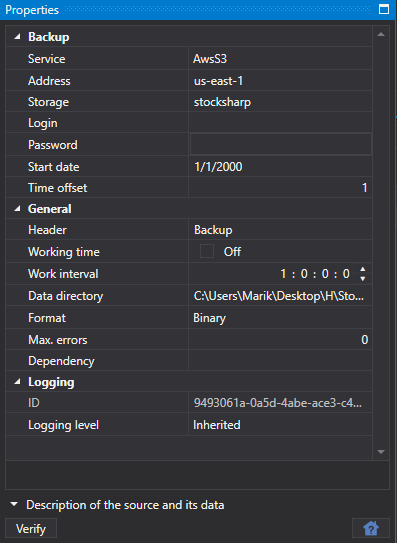

# Hydra 設定

以下では、バックアップタスクの作成と設定方法について説明します。

1. タスクを作成するには、**タスクを追加...** ボタンをクリックし、開いたウィンドウで **バックアップ** 項目を選択して **OK** ボタンをクリックします。
2. 次に、タスクを設定する必要があります。

   **バックアップ**
   - **サービス** - サービスアドレス。
   - **アドレス** - リージョンアドレス。バケット設定で指定したリージョンのアドレスです。[リージョンとエンドポイント](https://docs.aws.amazon.com/general/latest/gr/rande.html#s3_region) を参照してください。
   - **ストレージ** - バケット名。
   - **ログイン** - ログイン。**Access Key ID**。
   - **パスワード** - パスワード。**Secret Access Key**。
   - **開始日** - バックアップを開始する日付。
   - **時間オフセット** - 現在の日付からの日数オフセット。

   **全般**
   - **ヘッダー** - タスク名。
   - **稼働時間** - ボードの稼働スケジュールの設定。 
   - **動作間隔** - 操作の間隔。
   - **データディレクトリ** - 変換対象のデータを取得するデータディレクトリ。
   - **形式** - 変換後のデータ形式: BIN\/CSV。
   - **最大エラー数** - エラーの最大数。この数に達するとタスクが停止されます。既定では 0 で、エラー数は無視されます。
   - **依存関係** - 現在のタスクを実行する前に実行する必要があるタスク。

   **ログ**
   - **識別子** - 識別子。
   - **ログレベル** - ログレベル。
3. タスクの設定後、バックアップストレージに保存する銘柄を追加し、**開始** ボタンをクリックします。

## 推奨コンテンツ

[アカウントの作成と設定](setup.md)
