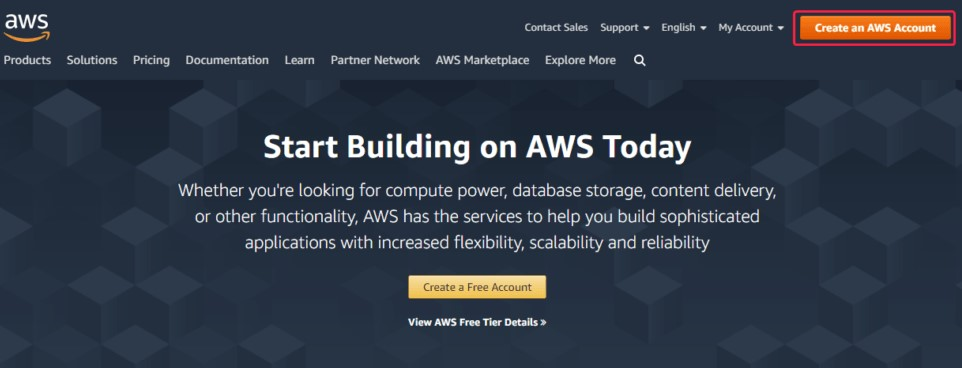
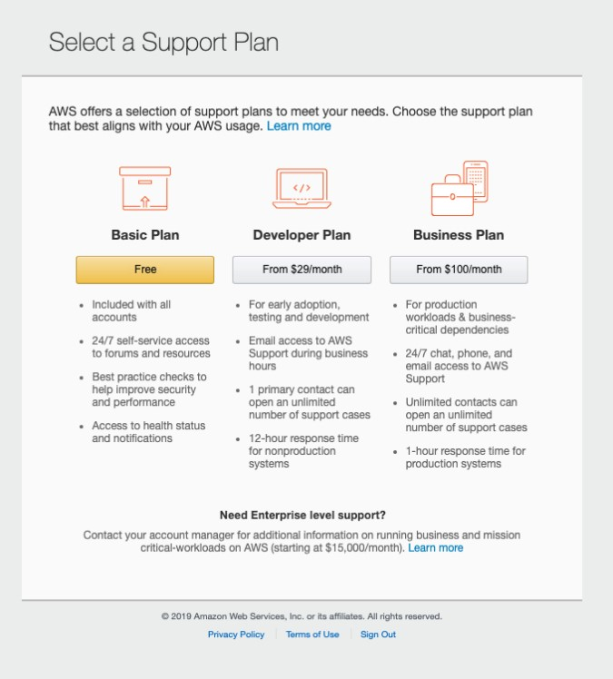

# セットアップ

以下では、AWS アカウントの作成と設定方法について説明します。

1. AWS アカウントを作成するには、[AWS アカウントを作成](https://aws.amazon.com/ru/) ページに移動し、**アカウントを作成** ボタンをクリックします。
2. 次に、Web サービスが提示するフォームに入力します。
3. カード情報を入力します。これは本人確認のために行われます。
4. 登録手順のいずれかで、電話番号を入力し、**Call Me Now** ボタンを使用して電話への通話を開始するよう求められます。

   通話に応答し、コンピューター画面に表示されるコードを電話で入力する必要があります。
5. 次に、サポートプランを選択するよう求められます。アカウントの作成が完了したら、管理コンソールに移動する必要があります。
6. アカウント設定の最初の手順は、Bucket の作成です。

   Bucket は、クラウド内でオブジェクトを保存するためのコンテナーです。Bucket には一意の名前を設定し、データが物理的に保存される地域データセンター（Region）も選択する必要があります。バックアップタスクを設定する際は、以降で次の点に注意してください。1) **ストレージ** フィールドにはバケット名を入力する必要があります。2) **アドレス** フィールドには名前ではなく、地域データセンターのアドレスを使用する必要があります。このアドレスは [こちら](https://docs.aws.amazon.com/general/latest/gr/rande.html#s3_region) で確認できます。その後、設定を続行します。
7. 次に、AWS サービスへプログラムからアクセスするためのキーを設定する必要があります。これを行うには、AWS コンソールの **Security Credentials** リンクに移動します。
8. **Access Keys (Access Key ID and Secret Access Key)** ヘッダーを展開し、 ボタンを使用してアクセスキーを作成します。

  作成されたキーは、**Download Key File** ボタンを使用してファイルに保存できます。

   バックアップタスクを設定する際は、**Access Key ID** をログインとして、**Secret Access Key** をパスワードとして使用する必要があることに注意してください。

## 推奨コンテンツ

[タスクの作成と設定](hydra_settings.md)
