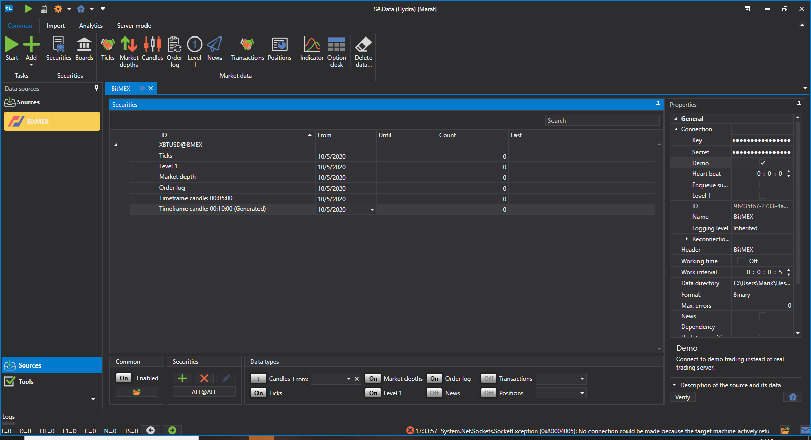
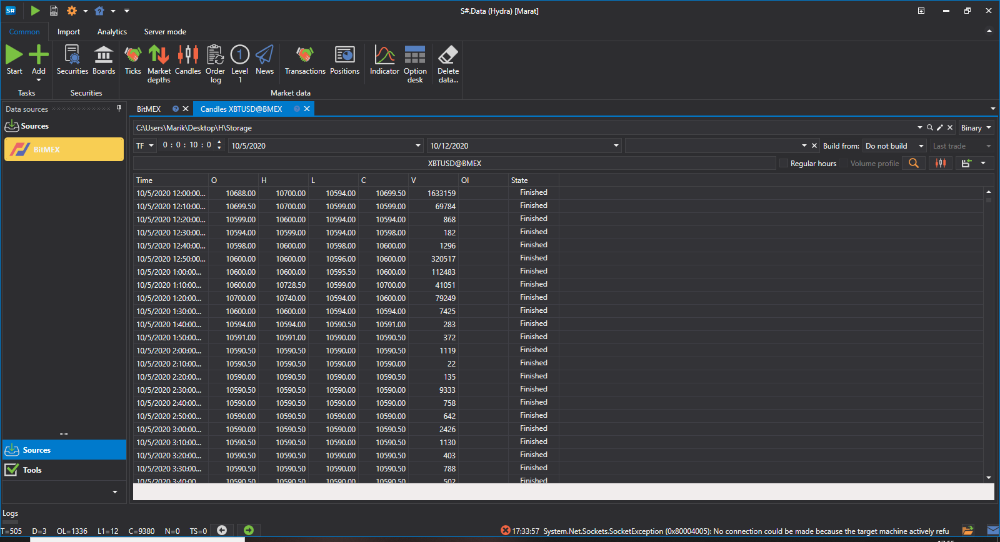

# カスタムローソク足

ユーザーはローソク足の **カスタムタイプ** を選択し、どのローソク足を構築するかを個別に選択できます。ローソク足は即座に構築されます。

このような構築の例を見てみましょう。**Bitmex** 取引所は、時間枠が10分のローソク足を受信する機能を提供していません。

このようなローソク足を取得する手順:

1. **Custom** ローソク足を選択します
2. 設定で、**TF** ローソク足と10分の期間を指定します
3. ソースで、ローソク足を何から構築するかを指定します - **注文ログ** 
4. 期間を設定します。見てわかるように、ローソク足名の横に **Generated** 表示が現れました。
5. start をクリックすると、データのダウンロードが開始されます。
6. ローソク足セクションに移動して、[ダウンロードされたデータを確認](../working_with_data/view_and_export.md)します。

見てわかるように、データは正常に受信されました。

[RangeCandleMessage](xref:StockSharp.Messages.RangeCandleMessage) を取得する必要がある場合の例を考えてみましょう:

1. **Custom** ローソク足を選択します。
2. 設定で、Range ローソク足とボリューム 10 を指定します。
3. ソースで、ローソク足を何から構築するかを指定します - **Ticks**。
4. 期間を設定します。
5. start をクリックすると、データのダウンロードが開始されます。
6. ローソク足セクションに移動して、[ダウンロードされたデータを確認](../working_with_data/view_and_export.md)します。
