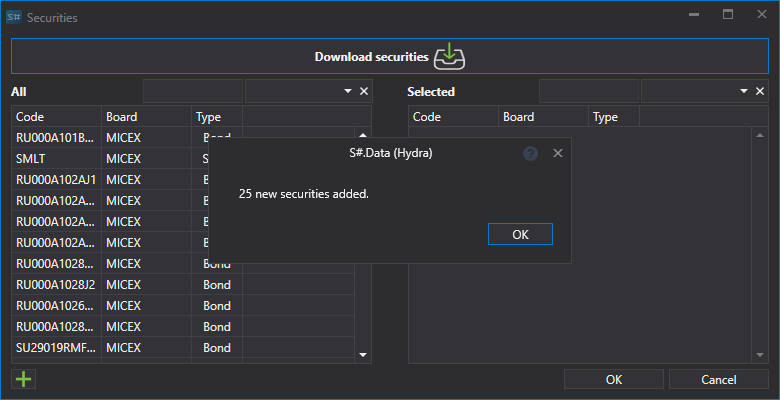
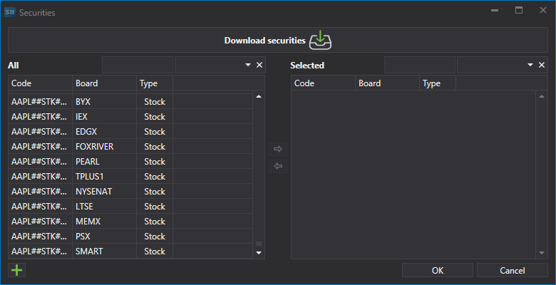

# 銘柄リスト

ダウンロード用の証券を設定します。

いくつかのソースでは、必要な証券をダウンロードするための設定を行うことができます。

**Interactive Brokers** ソースから証券をダウンロードする例を見てみましょう: 

1. 証券のダウンロードを選択し、**拡張条件** ボタンをクリックします。
2. その後、ダウンロードする証券の詳細設定リストが開きます。
3. 次のパラメーターを満たす証券をダウンロードする必要があります: APPLE の株式、通貨 - 米ドル。これを行うには、以下に示すように証券パラメーターを設定し、**OK** をクリックします。

   その後、[Hydra](../../hydra.md) プログラムは、指定したパラメーターを満たすすべての証券をダウンロードします。 

この設定により、ユーザーはダウンロードする証券のさまざまなパラメーターを選択できます。 

たとえば、ユーザーは次を選択できます:

- **価格と出来高のステップ**
- **最小出来高と最大出来高**
- **外部 ID** 
- オプションについては、**原資産** と **資産タイプ** (原資産証券の種類) を設定できます。 

**[ビデオチュートリアルを見る](../videos/instruments_downloading.md)**
