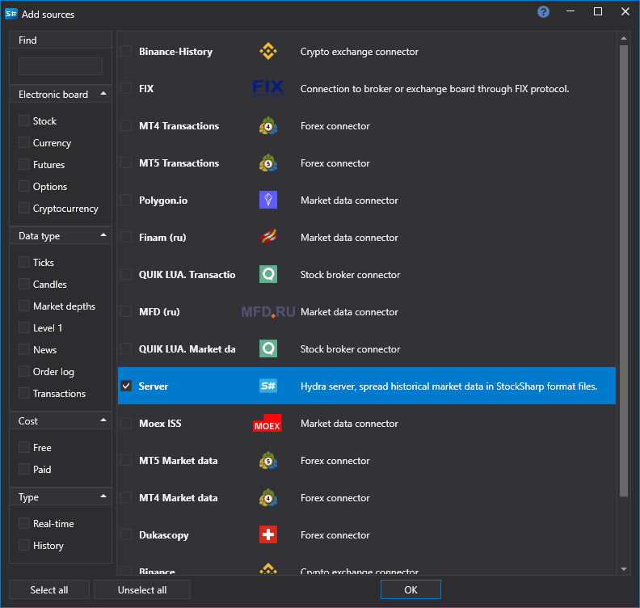

# Hydra クライアントの接続

サーバーモードでは、別の Hydra プログラムを接続できます。そのプログラムはクライアントとして動作し、自身にデータをダウンロードします。[FIX プロトコル経由の接続](fix_fast_connectivity.md)とは異なり、データは StockSharp 形式のファイルとして送信されます。そのため、このソースは大量の履歴データを転送する用途に適しています。

接続には専用のソースを使用します:

**設定**

- **アドレス** - Hydra サーバーのアドレス。
- **ログイン** - ログイン (サーバーが認証を要求する場合に必要)。
- **パスワード** - パスワード (サーバーが認証を要求する場合に必要)。
- **時間オフセット** - 現在日付からの日数で表す時間オフセット。現在の取引セッションの未完成データをダウンロードしないようにするために必要です。
- **週末** - 週末のデータをダウンロードするかどうか。

**メイン**

- **タイトル** - タスクのタイトル。
- **稼働時間** - プラットフォームの動作設定。
- **動作間隔** - 動作間隔。
- **データディレクトリ** - [S#](../../api.md) 形式の最終ファイルが保存されるデータディレクトリ。
- **形式** - データ形式: BIN/CSV。
- **最大エラー数** - エラーの最大数。この数に達するとタスクは停止されます。既定では 0 で、エラー数は無視されます。
- **依存関係** - 現在のタスクを開始する前に完了している必要があるタスク。

**ログ**

- **識別子** - 識別子。
- **ログレベル** - ログレベル。
