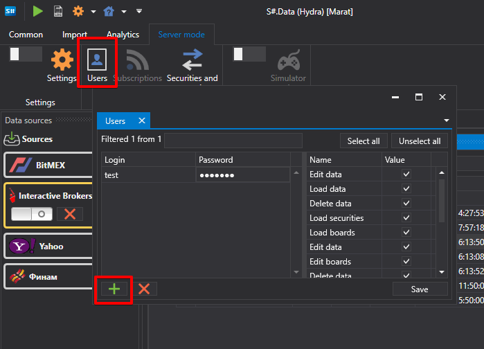

# 設定

[Hydra](../../hydra.md) はサーバーモードで使用できます。このモードでは [Hydra](../../hydra.md) にリモート接続し、ストレージ内の既存データを取得できます。サーバーモードで動作している [Hydra](../../hydra.md) には、[Designer](../../designer.md) から接続できます (その方法については [はじめに](../../designer/market_data_storage/getting_started.md) を [Designer](../../designer.md) ドキュメントで参照してください)。また、[Hydra](../../hydra.md) には [API](../../api.md) 経由で接続することもできます (詳細は [FIX/FAST 接続](fix_fast_connectivity.md) セクションを参照してください)。

サーバーモードでは、[Hydra](../../hydra.md) プログラムにより、ユーザーは1つの接続を使って複数のプログラムで同時に作業できます。プログラム設定でアクセスキーを設定することで、ユーザーは1つのアカウントで1つのソースを同時に使用できます。

実際には、ソースへの接続は [Hydra](../../hydra.md) 経由で行われ、たとえば [Designer](../../designer.md) や [Terminal](../../terminal.md) が同時に接続されます。この方法により、プログラム間の再接続や追加接続の購入を避けることができます。このような作業では、異なるプログラムからの注文登録や取引によって発生する競合が排除されます。[Hydra](../../hydra.md) はシグナルを受信し、それを受信したプログラムへ結果を返します。その間、他の作業の順序は乱されません。

[Hydra](../../hydra.md) サーバーモードを有効にするには、プログラムの上部メニューで **サーバーモード** タブを選択します。

その後、**設定** ボタンをクリックして、サーバーモード設定ウィンドウを開きます。

**Hydra サーバー**

- **FIX サーバー** - [Hydra](../../hydra.md) をサーバーモードに切り替え、FIX プロトコル経由でライブ取引データと履歴データを配信します。

  このセクションでは、ソースを使用するための接続を設定します:
  1. **ConvertToLatin** - キリル文字をラテン文字に変換
  2. **QuotesInterval** - 気配値の更新期間
  3. **TransactionSession** - 取引セッションの設定。[Hydra](../../hydra.md) プログラム経由で取引するための設定。

     この設定により、FIX プロトコルの Dialect、Sender と Recipient、Data format、およびその他の設定を構成できます。詳細は [FIXServer プロパティ](https://doc.stocksharp.ru/html/Properties_T_StockSharp_Fix_FixServer.htm) を参照してください。
  4. **MarketDataSession** - [Hydra](../../hydra.md) を使用して受信したマーケットデータを転送するための設定。詳細は [FIXServer プロパティ](https://doc.stocksharp.ru/html/Properties_T_StockSharp_Fix_FixServer.htm) を参照してください。
  5. **KeepSubscriptionsOnDisconnect** - ソースから切断されたときにサブスクリプションを保持します。
  6. **DeadSessionCleanupInterval** - 接続が切断された場合、どの時間間隔後に情報をクリアするか。
- **認可** - Hydra サーバーへのアクセス権を得るための認可
- **銘柄数** - サーバーからリクエストできる銘柄の最大数
- **ローソク足（日）** - ローソク足履歴をダウンロードできる最大日数
- **ティック（日）** - ティックデータ履歴をダウンロードできる最大日数
- **板情報（日）** - 板情報履歴をダウンロードできる最大日数
- **OL（日）** - OL データ履歴をダウンロードできる最大日数
- **トランザクション（日）** - トランザクション履歴をダウンロードできる最大日数
- **Simulator** - シミュレーターモードをオンにします
- **銘柄マッピング** - 指定した銘柄のみの転送モードを有効にします。

**認可** を **匿名** 以外に設定すると、**共通** タブに **ユーザー** ボタンが表示されます。それをクリックすると、**ユーザー** ウィンドウが表示されます。

ウィンドウの左側で新しいユーザーを追加でき、右側でそのユーザーのアクセス権を設定できます。
