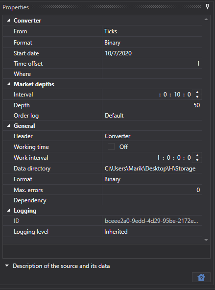

# コンバーター

このタスクは取引所データを変換します。たとえば、Order Logs からティックへ、またはティックからローソク足へ変換する、などです。

**Converter**

- **Converter** - コンバーター。 
- **From** - どのデータ型を変換するか。 
- **Data format** - 変換後のデータ形式。 
- **Start date** - どの日付からデータ変換を開始するか。 
- **Time offset** - タスクが開始された日付からの日数で表す時間オフセット。これにより未完成日の変換を防ぎます。リアルタイムデータ変換が設定されている場合、更新間隔によって現在日が部分的にしか変換されないことがあります。それを避けるために時間オフセットを使用します。
- **Where** - 変換後のデータを保存するデータディレクトリ。 

**Order books**

- **Interval** - 板情報の生成間隔。 
- **Depth** - 板情報生成の最大深度。 
- **Order log** - 注文ログから板情報を構築する方法。 

  各取引所には独自の **Order Log** 形式があり、[Hydra](../../hydra.md) プログラムは3つの形式をサポートしています:
  - **By default** - ほとんどの場合に使用されます。
  - **ITCH** - ITCH プロトコルで使用されます (取引所: LSE と Nasdaq)。

**General**

- **Header** - Converter。 
- **Working hours** - ボード稼働スケジュールの設定。 
- **Interval of operation** - 動作間隔。 
- **Data directory** - 変換用のデータを受け取るデータディレクトリ。 
- **Format** - 変換後のデータ形式: BIN\/CSV。 
- **Max. errors** - エラーの最大数。この数に達するとタスクは停止されます。既定では 0 で、エラー数は無視されます。 
- **Dependency** - 現在のタスクを実行する前に実行されている必要があるタスク。 

**Logging**

- **Identifier** - 識別子。 
- **Logging level** - ログレベル。 

データ変換の例を見てみましょう。

1. **Converter** タスクに移動します。 
2. 銘柄を選択し、表示されるウィンドウで、変換中に受け取るべきデータ型と、変換元となるデータ型を設定します。たとえば、Ticks を Time Frame 15分のローソク足に変換する必要があるとします。

   > [!TIP]
> 重要\! 要求するデータ期間は、変換可能な期間と一致している必要があります。一致していない場合、データは変換されません。設定では、変換対象データの形式と一致するように、正しいソースデータ形式を指定してください。
3. 必要なディレクトリを指定します。時間オフセット。動作間隔。 
4. 変換を開始します。

データが変換されたことがわかります。生成されたデータを[確認してみましょう](../working_with_data/view_and_export.md)。 

この機能は、別のデータ型から[必要なマーケットデータを取得する](../working_with_data/any_market_data_types.md)機能に似ています。 

**[ビデオチュートリアルを見る](../videos/converter_task.md)**
