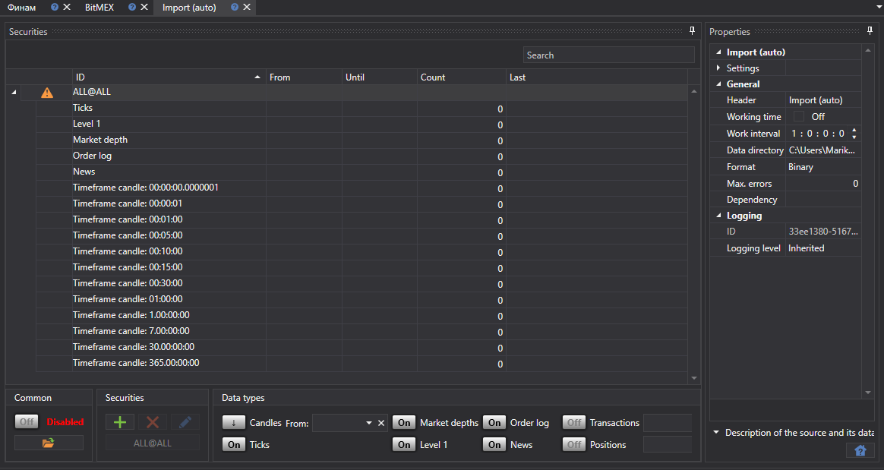

# Import (auto)

このタスクは、指定したディレクトリ内のファイルから、指定したファイルマスクに従って取引所データを自動インポートします。

選択した各マーケットデータ型について、テンプレートは [インポート](../importing.md) タブで設定されます。

パネルの下部では、データをインポートする対象の銘柄と、インポートするデータ型を選択できます。

各銘柄について、次のデータインポートプロパティを指定できます:

**Import (auto)**

**Settings**

- **Data type** - インポートされるデータの種類。 
- **Filename** - ファイルへの完全パス。 
- **Data directory** - データディレクトリ。 
- **File mask** - ディレクトリをスキャンするときに使用されるファイルマスク。例: candles\*.csv。 
- **Subdirectories** - サブディレクトリを含めます。 
- **Column separator** - 列区切り文字。タブは TAB で示されます。 
- **Indent from the beginning** - ファイルの先頭からスキップする行数 (メタ情報を含む場合)。 
- **Time zone** - タイムゾーン。 
- **Interval** - データ更新の頻度。 
- **Extended information** - インポートされた拡張フィールドを拡張情報ストレージに保存します。
- **Duplicates** - 重複する銘柄がすでに存在する場合に更新する必要があるかどうか。 
- **Ignore without ID** - 識別子のない銘柄を無視します。 

**General**

- **Header** - Converter。 
- **Working hours** - ボード稼働スケジュールの設定。 
- **Interval of operation** - 動作間隔。 
- **Data directory** - 変換用のデータを受け取るデータディレクトリ。 
- **Format** - 変換後のデータ形式: BIN\/CSV。 
- **Max. errors** - エラーの最大数。この数に達するとタスクは停止されます。既定では 0 で、エラー数は無視されます。 
- **Dependency** - 現在のタスクを実行する前に実行されている必要があるタスク。 

**Logging**

- **Identifier** - 識別子。 
- **Logging level** - ログレベル。 
