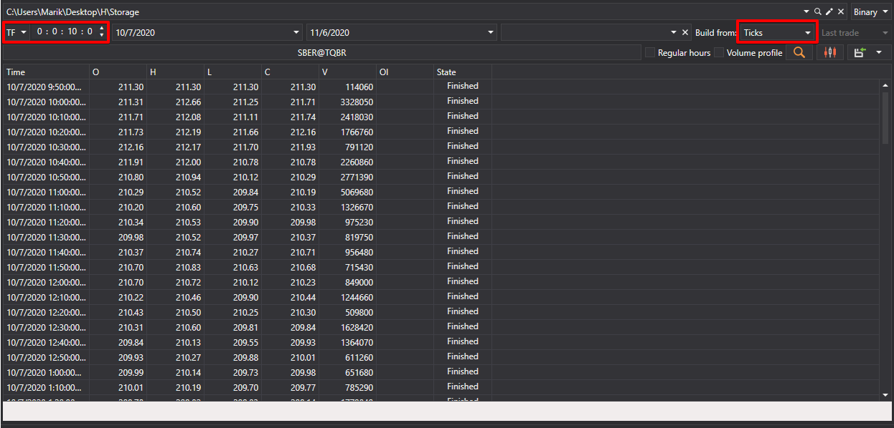

# ローソク足の生成

[Hydra](../../hydra.md) では、ダウンロード済みの約定に基づいてさまざまな種類のローソク足を生成でき、その後 [Excel](https://en.wikipedia.org/wiki/Excel)、XML、SQL、BIN、JSON、または TXT 形式へエクスポートできます。

これにより、生成されたデータを任意のテクニカル分析プログラム (WealthLab、AmiBroker など) で使用できます。

## ローソク足生成プロセス

1. **全般** タブで **ローソク足** ボタンをクリックすると、次のウィンドウが開きます。

   

2. 開いたウィンドウで、ローソク足生成パラメーターを設定する必要があります。

   - ドロップダウンリストから目的のローソク足タイプを選択します (すべての [標準ローソク足タイプ](../../api/candles.md) がサポートされています)
   - 選択したローソク足タイプに必要なパラメーターを指定します。
     - [TimeFrameCandleMessage](xref:StockSharp.Messages.TimeFrameCandleMessage) の場合 - **時間枠** を選択します
     - [VolumeCandleMessage](xref:StockSharp.Messages.VolumeCandleMessage) の場合 - **出来高** を指定します
     - [TickCandleMessage](xref:StockSharp.Messages.TickCandleMessage) の場合 - **ティック数** を指定します
     - [RangeCandleMessage](xref:StockSharp.Messages.RangeCandleMessage) の場合 - **レンジ** を指定します
     - [RenkoCandleMessage](xref:StockSharp.Messages.RenkoCandleMessage) の場合 - **ブロックサイズ** を指定します
     - [PnFCandleMessage](xref:StockSharp.Messages.PnFCandleMessage) の場合 - **P&F パラメーター** を指定します
   - ローソク足を生成する銘柄を選択します
   - 時間範囲を指定します (必要な場合)
   -  ボタンをクリックして生成を開始します

### 時間枠ローソク足生成の例

AAPL@NASDAQ 銘柄の 5 分足を生成するには、次の手順を実行します。

1. ローソク足タイプ [TimeFrameCandleMessage](xref:StockSharp.Messages.TimeFrameCandleMessage) を選択します
2. **時間枠** = 5 分 に設定します
3. AAPL@NASDAQ 銘柄を選択します
4. 検索ボタンをクリックします

データ生成後、結果が表示されます。

### ボリュームローソク足生成の例

ボリュームローソク足を生成するには、次の手順を実行します。

1. ローソク足タイプ [VolumeCandleMessage](xref:StockSharp.Messages.VolumeCandleMessage) を選択します
2. ボリュームを指定します (例: 100)
3. 銘柄を選択します
4. **構築元** フィールドで **ティック** を選択します
5. 検索ボタンをクリックします

生成結果:

## ローソク足構築用のデータソース

マーケットデータをソースから直接取得できなかった場合は、[**構築元**](any_market_data_types.md) フィールドで構築元となるデータの種類を選択して、ローソク足を生成できます。

- **ティック** - ティックデータからローソク足を構築します
- **板情報** - 板情報データからローソク足を構築します
- **Level1** - Level1 データからローソク足を構築します
- **小さい時間枠** - より小さい時間枠のローソク足から、より大きい時間枠のローソク足を構築します

### さまざまな構築オプションの例:

- ティックから 10 分足を構築:

  

- 5 分足から 30 分足を構築:

  

> [!TIP]
> **構築元** フィールドで **構築しない** を選択すると、データソースを通じて直接ダウンロードされた既製のローソク足のみが検索されます。

## 生成されたローソク足の可視化

生成されたローソク足をグラフィカルに表示するには、次の手順を実行します。

1.  ボタンをクリックします
2. 構築されたローソク足のチャートが開きます。

   

   

## チャートへのインジケーターの追加

テクニカルインジケーターをローソク足チャートに追加できます。

1. チャートパネルを右クリックしてコンテキストメニューを開きます
2. **インジケーター** 項目と、リストから目的のインジケーターを選択します
3. インジケーターを別のパネルに表示するには、次の手順を実行します。
   -  ボタンを使用して新しいパネルを追加します
   - コンテキストメニューから目的のインジケーターを選択します

インジケーターを追加したチャートの例:

## データのエクスポート

取得したローソク足の値は、他のプログラムで使用するために [さまざまな形式へエクスポート](export_data.md) できます。

**さまざまな種類のローソク足構築については、[動画チュートリアル](../videos/building_candles.md)も参照してください**
