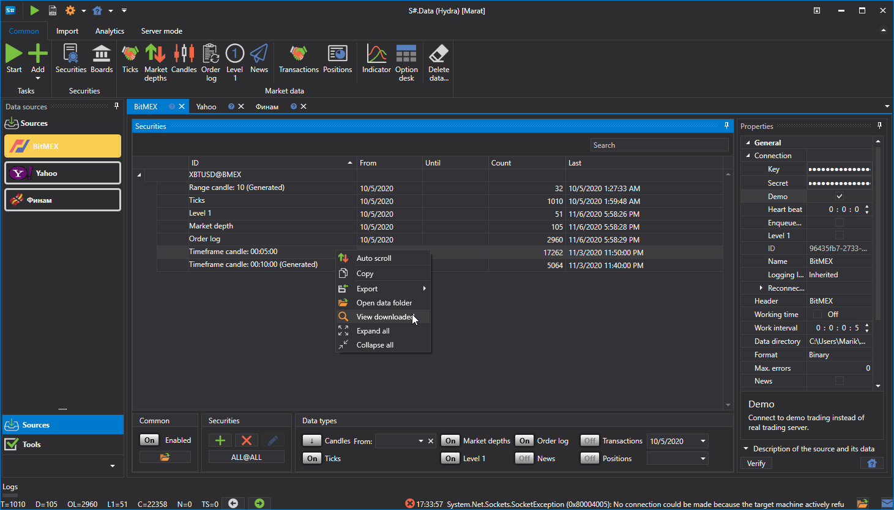
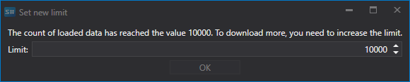

# 表示とエクスポート

受信した [Hydra](../../hydra.md) データは、専用パネルで表示できます。 

これを行うには、**共通** タブで次のいずれかのボタンをクリックします: [ティック](view_and_export/ticks.md)、[板情報](view_and_export/order_books.md)、[ローソク足の生成](candles_generation.md)、[注文ログ](view_and_export/order_log.md)、[Level 1](view_and_export/level_1_.md)、[ニュース](view_and_export/news.md)、[トランザクション](view_and_export/transactions.md)、[オプションデスク](view_and_export/option_desk.md)、[インジケーター](view_and_export/indicators.md)、[ポジション](view_and_export/positions.md)。 

または、図に示すように必要なデータ型を右クリックするか、必要なデータ型をダブルクリックします。

各パネルには、次のような設定用の共通インターフェイスがあります。

- 上の行には、マーケットデータストレージとその形式 (BIN または CSV) が示されます。
- 下の行では、データを要求する期間を設定します。**銘柄の選択** ボタンをクリックすると銘柄選択ウィンドウが表示され、1 つまたは複数の銘柄を選択できます。複数の銘柄を選択した場合、その後 Excel または CSV へエクスポートするときに、プログラムは異なる銘柄のデータを自動的に別々のファイルへ振り分けます。 
- データを含むテーブルを構築するときに、ダウンロード済みデータの量が設定された上限を超えると、画面にウィンドウが表示されます:

  ダウンロードするデータの上限を増やす必要があります。
- データが現在のタイムゾーンと一致しないタイムゾーンのソースから受信された場合、タイムゾーンを調整できます。構築後、データはユーザーが選択したゾーンで表示されます。 
- 一部のソースは特定のデータをダウンロードする機能を提供していないため、プログラムには[構築元](any_market_data_types.md)フィールドが用意されています。このフィールドを使用すると、ユーザーは別の種類のマーケットデータからマーケットデータを構築できます。同じ機能を使用して、既存のデータを基に、追加のダウンロードなしでマーケットデータを構築することもできます。
- 上記のパラメーターを選択した後、 ボタンをクリックします。

コンテキストメニューを使用すると、マーケットデータ値テーブルの各種パラメーターを設定できます。行のグループ化、利用可能な列、表示形式などです。

