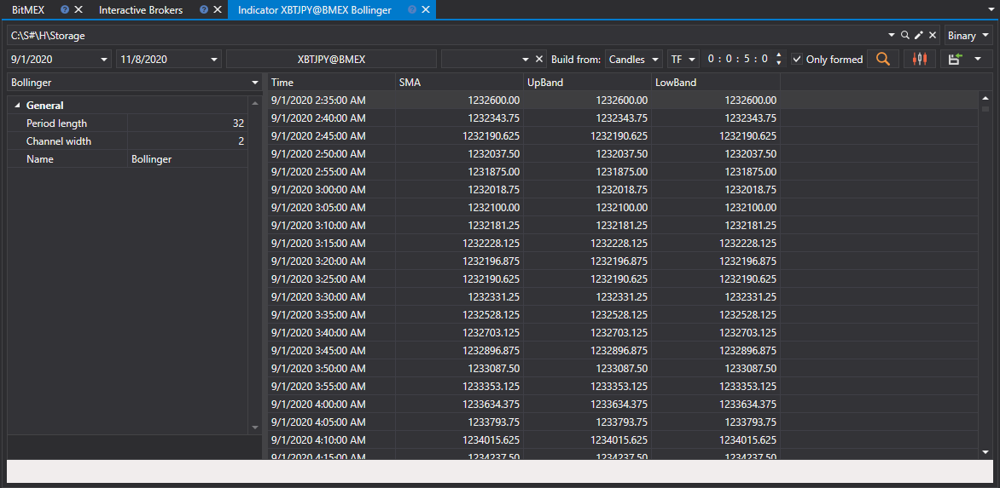

# インジケーター

表示されたパネルで、銘柄と対象の時間範囲を選択し、インジケーターを構築する元となるデータ型を指定し、[インジケーター](../../../api/indicators/list_of_indicators.md) とそのパラメーターを設定してから、 ボタンをクリックします: :

値のチャートを表示するには、 ボタンをクリックするだけです。

受信した値は [必要な形式へエクスポート](../export_data.md) できます。

