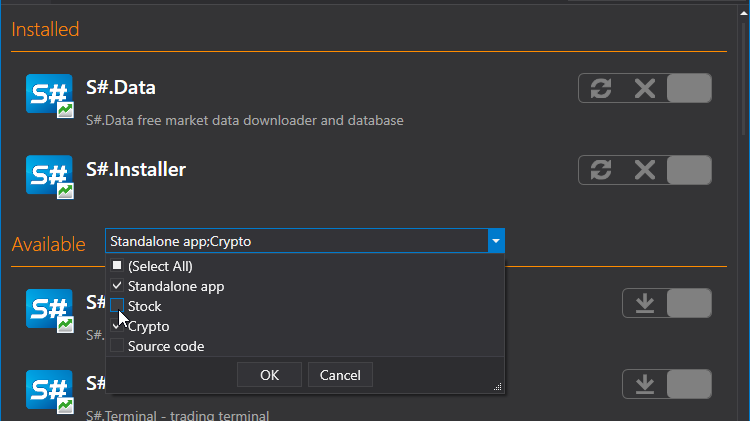

# アプリのインストールと削除

[Installer](../installer.md) プログラムでは、必要な製品を見つけるためにアプリケーションの種類を選択できます。

必要なアプリケーションをインストールするには、次の手順を行います。

1. アプリケーションを選択し、**Install** をクリックし、ライセンス契約に同意して **Continue** をクリックします。
2. その後、インストールパスを選択する必要があります。 

   **重要\!** プログラムをインストールするフォルダーは空でなければなりません。 

   **Continue** をクリックします。
3. **Run** を選択し、インストールが完了するまで待ちます。 

インストールが完了すると、プログラムを使用できる状態になります。 

プログラムをアンインストールするには、**Uninstall** を選択し、**Continue** ボタンをクリックします。

復元するには、**Restore** を選択し、**Continue** をクリックします。

**[ビデオチュートリアル](videos/install_and_remove_apps.md)を見る**

## おすすめコンテンツ

[アプリの更新](update_apps.md)

