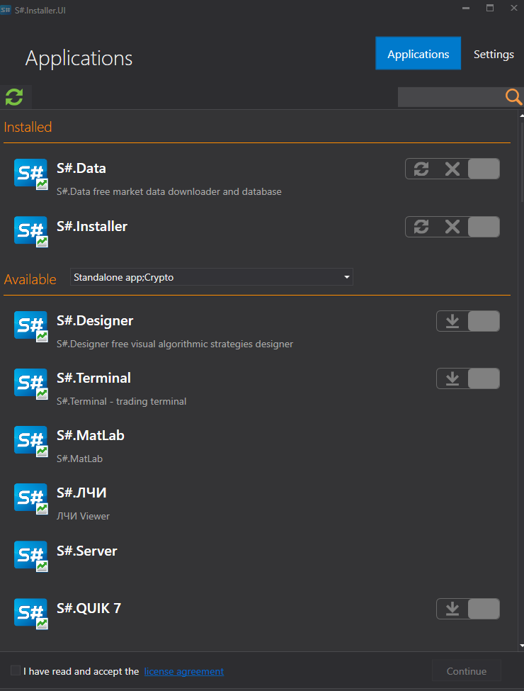

# 初回実行

1. [Installer](../installer.md) をインストールするには、[ダウンロード](https://stocksharp.com/products/download/) ページに移動します。
   
    

2. [Installer](../installer.md) のディストリビューションをダウンロードします。
3. インストールファイル **stocksharp_setup.exe** を実行し、インストーラーの指示に従います。
4. Windows がすぐにインストールを開始せず、警告を表示することがあります。

   

5. この場合、警告ウィンドウの **More info** リンクをクリックすると、次のウィンドウが表示されます。

    

    **Run anyway** ボタンをクリックすると、[Installer](../installer.md) のインストールが開始されます。

6. その後、[Installer](../installer.md) が展開されます。処理が完了するまで待ちます。
7. 初回起動時には、**StockSharp** のログイン名とパスワードを入力する必要があります。

    

    資格情報を直接入力するか、ソーシャルネットワーク認証を介してサインインできます。ソーシャルネットワーク経由で StockSharp ウェブサイトに登録した場合、パスワードはありません。

8. ログイン後、プログラムウィンドウが開きます。

**[ビデオチュートリアル](videos/setup.md)を見る**

## 関連項目

[プログラムのインストールと削除](install_and_remove_apps.md)

