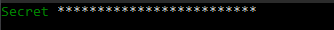

# 接続設定

**Runner** は、[Designer から設定をエクスポートする](export_from_designer.md)ことに加えて、コンソールインターフェイスからプログラムを設定する機能を提供します。これを行うには、**setup** コマンドを指定してプログラムを実行する必要があります。

```cmd
stocksharp.studio.runner setup
```

メニューが表示されます。


接続項目を選択すると、プログラムはコネクター設定モードに入ります。


ここでは、以前に保存した接続を編集するか、新しい接続を作成できます。


必要な新規接続の種類を選択すると、プログラムはその設定の編集メニューに移動します。


[Binance](../api/connectors/crypto_exchanges/binance.md) では、主要な設定を入力する必要があります。





入力したデータが正しいことを確認するには、**確認** を選択します。


接続チェックが開始されます。


成功した場合、メッセージが表示されます。


すべての設定を入力して確認したら、**保存** を押す必要があります。


Data フォルダーに **connector.json** ファイルが作成され（まだ作成されていない場合）、保存された設定が含まれます。

[Telegram](../telegram_services.md) との統合を設定するには、メニュー項目を選択します。


そして、都合のよい方法で認証します。


トークンで認証する場合は、[https://stocksharp.ru/profile/](https://stocksharp.ru/profile/) のトークンを入力します。


成功した場合、プログラムは利用可能な Telegram 操作オプションを表示します。


