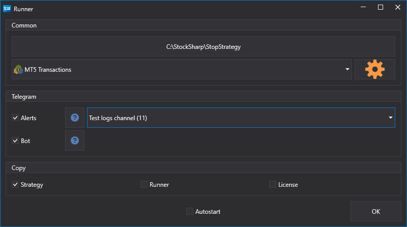

# Designer からのエクスポート

**Runner** では、[Designer](../designer.md) で作成されたストラテジーを実行できます。すべての設定を視覚的に行えるため、これは **Runner** をセットアップする最も便利な方法です。

[Designer](../designer.md) からストラテジーをエクスポートするには:

- ツリーで目的のストラテジーを選択し、右クリックして **Runner** メニュー項目を選択します。

  

- 表示されるウィンドウで、**Runner** にエクスポートする必要がある接続の種類と、[Telegram](../telegram_services.md) 経由でストラテジーを管理するための設定を選択する必要があります。

  

次のファイルが選択したエクスポートディレクトリにコピーされます。

- connector.json - 接続設定を含むファイル
- params.json - ストラテジーパラメーターを含むファイル
- start.bat - **Runner** をすばやく起動するためのコマンドラインがすでに記述された bat ファイル
- strategy.json - ストラテジーを含むファイル
- connector.json - 接続設定を含むファイル
- telegram.json - [Telegram](../telegram_services.md) との統合設定を含むファイル
