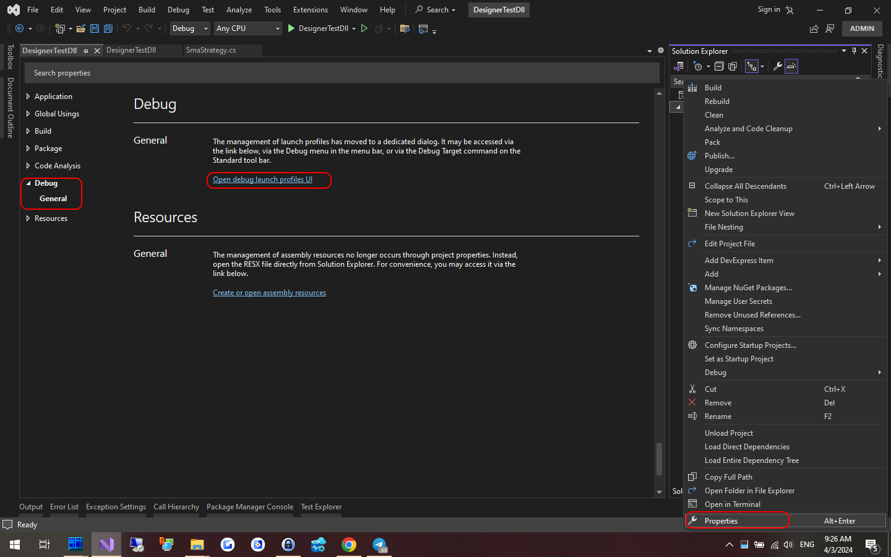

# Visual Studio との統合

**Runner** は、[Designer](../designer/strategies/using_dll/debug_dll_in_visual_studio.md) と同様に、ストラテジーをデバッグする手段として使用できます。ストラテジーを **Runner** でのみ実行する予定の場合に便利です。それ以外の場合は、[Designer](../designer.md) プログラム内でストラテジーを起動して操作するほうが便利です。

デバッグプロセスを設定するには、次の手順を実行する必要があります。

1. 取引ストラテジープロジェクトを右クリックし、コンテキストメニューから **プロパティ** を選択します。



表示されるタブで **デバッグ** 項目を見つけ、**全般** セクションを選択して **デバッグ起動プロファイル UI を開く** をクリックします。

2. 次に、開いたウィンドウで、外部プログラムを起動する新しいデバッグプロファイルを作成します。


3. **Runner** へのフルパスを入力し、起動用のコマンドラインパラメーターを指定します。[Runner のコマンドライン](command_line.md)の詳細。


例のコマンドライン引数:

```cmd
l -s "$(TargetPath)" -c "C:\StockSharp\Runner\Data\connection.json" --sec BTCUSDT_PERPETUAL@BNB --pf Binance_-298049655_Futures
```

$(TargetPath) - は、デバッグ起動時に、ストラテジーを含むコンパイル済み DLL へのパスに自動的に置き換えられる特別な **Visual Studio** マクロです。

4. プロジェクト設定ウィンドウを閉じ、プロジェクトのデバッグを開始します（たとえば F5 キー）。**Runner** プログラムウィンドウが表示され、取引接続プロセスが表示されます。


5. ブレークポイントを設定すると、そこに到達した時点でプログラムの実行が停止します。たとえば、新しいローソク足が表示されたときの取引ロジックをデバッグする場合:


