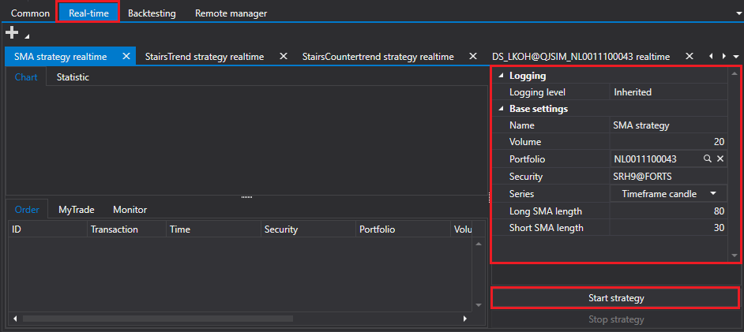

# クイックスタート

[Shell](../shell.md) は、Visual Studio 環境または同様の環境で [C#](https://en.wikipedia.org/wiki/C_Sharp_(programming_language)) 言語を使ってプログラミングすることに重点を置いています。

[Shell](../shell.md) プロジェクトを起動すると、ソリューション エクスプローラーに Shell プロジェクトが表示されます。

**ストラテジー** フォルダーには、[Shell](../shell.md) に含まれる 3 つのストラテジー、既定のストラテジー用のシェル、およびいくつかの補助インターフェイスが含まれています。

[Shell](../shell.md) に既に含まれているストラテジーでどのように動作するかを確認するために、事前準備なしでプロジェクトを起動できます。

起動後、次のようなウィンドウが表示されます。

接続設定と接続ボタン、および現在の Shell 構成を保存するボタンは、画面上部に配置されています。メインタブもそこに配置されています。

接続設定に移動し、必要な接続を選択します。接続の設定方法は、[接続設定](connections_settings.md)で説明しています。

次の手順は、**接続** ボタン  をクリックして接続することです。

接続後、[共通](user_interface/common.md) タブで、接続から受信したポートフォリオ、銘柄、注文、および自己約定を確認できます。

リアルタイムタブに移動し、**追加**  ボタンをクリックして、取引用のストラテジーを追加します。

ストラテジーを追加したら、**銘柄**、**ポートフォリオ** などの基本パラメーターを入力します。**ストラテジー開始** ボタンをクリックして起動します。

[リアルタイム](user_interface/real_time.md) タブと同様に、[エミュレーション](user_interface/emulation.md) タブでは、ヒストリカルデータに対してストラテジーのテストを実行できます。

