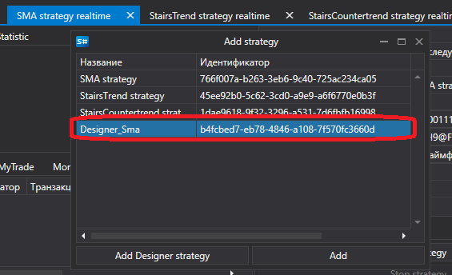

# Designer からストラテジーを実行

[Shell](../shell.md) は、[Designer](../designer.md) で作成されたストラテジーを実行できます。

[Designer](../designer.md) で作成されたストラテジーを起動するには、[リアルタイム](user_interface/real_time.md) タブでそのストラテジーを選択し、**Designer ストラテジーを追加** ボタンをクリックします。表示されるウィンドウで、[Designer](../designer.md) からエクスポートしたストラテジーファイルを選択します。

その後、利用可能なストラテジーのリストに表示されます。

追加したストラテジーを選択すると、必要なパラメーターを設定し、取引用に起動できます。

## 推奨コンテンツ

[ストラテジーの作成](create_strategy.md)
