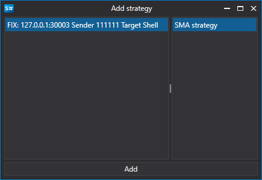
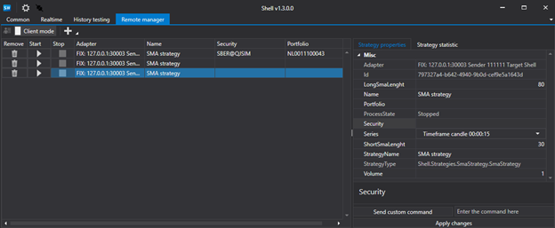
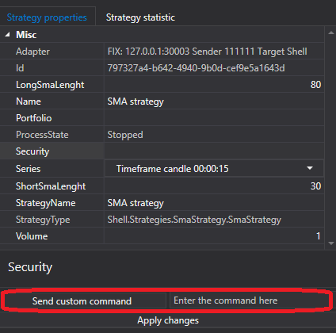

# RemoteManager

**RemoteManager** タブでは、リモート制御モードを有効にできます。このモードを有効にするには、ユーザー設定メニューに移動する必要があります。


表示されるウィンドウで、**login** と **password** を設定します。


次に、**server mode** を有効にする必要があります。


これで、別の Shell から Shell に接続できるようになります。

そのためには、**別の Shell** を起動する必要があります。その中で、接続設定に移動します。


開いたウィンドウで、FIX 接続を設定します。


次に、Connect ボタンを押します。


接続すると、Shell サーバー内に存在するすべてのストラテジーが Shell クライアントで利用可能になります。


Add ボタンをクリックすると、取引用に別のストラテジーを追加できます。


Shell クライアントは複数のサーバーをサポートしているため、ストラテジーを追加する際には左側でサーバーを選択する必要があります。サーバーで利用可能なすべてのストラテジーが右側に表示されます。



ストラテジーを追加すると、ストラテジー一覧に表示されます。



ストラテジーを選択すると、右側にストラテジー設定と統計情報のタブが表示されます。

ストラテジー設定を変更した後は、必ず Apply changes ボタンをクリックしてください。そうしないと、変更はストラテジーに適用されません。


ストラテジーに Start\/Stop 以外のコマンドがある場合、それを適用するには次のフィールドに設定する必要があります。



そして、send command ボタンをクリックします。

ストラテジーで独自のコマンドを設定するには、[Strategy.ApplyCommand](xref:StockSharp.Algo.Strategies.Strategy.ApplyCommand(StockSharp.Messages.CommandMessage))**(**[StockSharp.Messages.CommandMessage](xref:StockSharp.Messages.CommandMessage) cmdMsg **)** メソッドをオーバーライドする必要があります。

```cs
public virtual void ApplyCommand(CommandMessage cmdMsg)
		
```

[Strategy](xref:StockSharp.Algo.Strategies.Strategy) 基底クラスは、ストラテジーの開始と停止のみを制御します。

## 推奨コンテンツ

[接続設定](../connections_settings.md)

