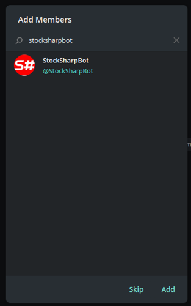
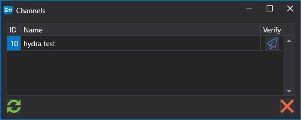

# アラート

アプリケーション（[Designer](../designer.md) や独自のカスタムプログラムなど）から Telegram メッセンジャー内のプライベートおよびパブリックのチャンネルまたはグループへメッセージを送信するためのサービスです。

設定するには:

1. [ボット認可プロセス](authorization.md) を完了します。

2. チャンネルまたはグループ（プライベートまたはパブリック）を作成します。

   
   

3. ボット [StockSharpBot](https://t.me/StockSharpBot) を追加します。

   

4. 管理者にします。

   

5. 正常動作に必要な権限

   

6. チャンネルまたはグループに特別な単語 **activate** を書き込みます。

   

7. 成功すると、応答を受け取ります。

   

作成したチャンネルは、ストラテジーおよび取引ロボットで利用できるようになります。

  - [Designer](../designer.md) を使用する場合は、上部パネルのチャンネル一覧をクリックします。

  

  表示されるウィンドウには、ボットを有効化したすべてのチャンネルとグループの一覧が表示されます。

  

  Telegram アイコンボタンを押すと、テストメッセージが送信されます。受信できれば、すべてが正しく設定されていることを意味します。

  

  *無料料金プランでは、StockSharp サイトに言及する行が追加されます。有料料金プランでは、この行は削除されます。*

Telegram に複数の出力チャンネルがあり、異なるストラテジーを別々のチャンネルに向けたい場合は、設定で各ストラテジーのチャンネルを指定できます。

- その他のプログラムでは、設定は [Designer](../designer.md) と同様に行います。たとえば [Hydra](../hydra.md) プログラムでは、[Hydra](../hydra.md) がサーバー上にある場合に、市場データダウンロードのエラーログを設定し、動作していない接続に関する情報を速やかに受け取ることができます。
- [Shell](../shell.md) または [S#](../api.md) の場合は、ストラテジーを Telegram サービスと連携させるコードを確認できます。

