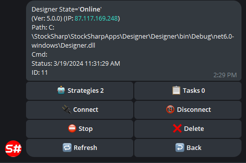

# コントロールパネル

Telegram ボットを介して取引ストラテジーとロボットを管理するためのサービスです。

設定するには、事前に [ボット認可プロセス](authorization.md) を実行します。

その後、ボットを使用できるようになります。次に、ボットがストラテジーを認識し始めるようにするには、次の操作が必要です。

 - [Designer](../designer.md) プログラムを使用する場合は、クラウド パネルでリモートモードを有効にします。

  

  Live モードで実行されるすべてのストラテジーは自動的に Telegram ボットに転送され、スマートフォンから制御できるようになります。

  [StockSharpBot](https://t.me/StockSharpBot) で /apps コマンドを選択し、すべてのプログラム一覧を表示します。

  

  目的のプログラムを選択すると、ストラテジーとその制御項目を確認できます。

  

  

  

 - [Shell](../shell.md) を使用する場合は、RemoteManager パネルに移動し、[Designer](../designer.md) と同様に設定を構成します。
 - [Hydra](../hydra.md) を使用する場合は、[Designer](../designer.md) と同様の操作を行います。[Hydra](../hydra.md) との連携により、市場データのダウンロードを管理し、数量統計を監視できます。

  
  

 - [S#](../api.md) を使用する場合は、[Shell](../shell.md) のコードを使用して連携できます。[S#](../api.md) はクロスプラットフォームであるため、ロボットは任意のオペレーティングシステムで実行できます。
