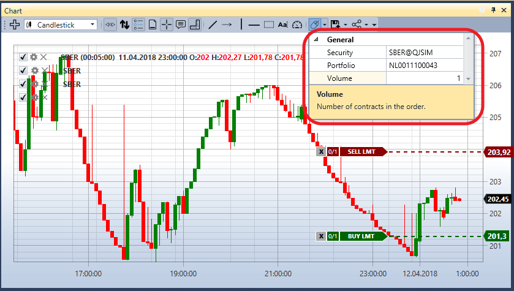

# チャート

**チャート** コンポーネントでは、選択した銘柄のローソク足とインジケーターを描画できます。

新しい領域を追加するには、 ボタンをクリックします。

チャートに新しい要素を追加するには、チャート領域内の任意の場所を右クリックし、必要な要素を選択します。利用可能なオプションには、ローソク足、インジケーター、注文、自己約定が含まれます。

各チャートの左上隅には、チャートに追加されたすべてのグラフィカル要素が表示されます。グラフィカル要素のチェックボックス  をオフにすると、その要素もチャートから削除されます。

 をクリックすると、グラフィック要素の設定が開きます。

チャートから注文を登録できます。これを行うには、まず注文を登録する対象の **銘柄** と **ポートフォリオ** を指定します。

買い注文は、**Ctrl キーを押しながら左クリック** して登録します。

売り注文は、**Ctrl キーを押しながら右クリック** して登録します。

グラフィカル要素の設定では、必要なチャートスタイルを設定できます。日本式ローソク足、バー、ボックスチャート、クラスタープロファイルなどです。

ボックスチャートでは、ローソク足をグループ化することもできます。グループ化の順序は、2 番目のタイムフレームの乗数と 3 番目のタイムフレームの乗数のフィールドで設定します。

チャートの上にはツールバーがあり、自動スクロール、自動ズーム、凡例モード、その他の一般的なチャート設定を選択できます。また、チャート上に描画する要素として、線、レベル、ポインター、四角形、テキストを選択することもできます。

## 関連項目

[注文](../../../designer/user_interface/components/orders.md)
