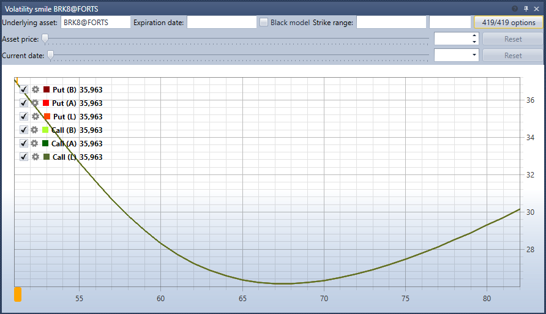

# スマイル・ボラティリティ

**スマイル・ボラティリティ** コンポーネントは、同じ原資産で異なる権利行使価格を持つオプションについて、予想されるボラティリティ水準をグラフィカルに表現したものです。

ボラティリティ・スマイルを表示するには、原資産と、その価格に基づいてボラティリティ・スマイルを構築するオプションを選択する必要があります。

さらに、オプションの正確な満期日に対するフィルターと、最小\/最大の権利行使価格に対するフィルターを指定できます。

## 推奨コンテンツ

[注文ログ](order_log.md)
