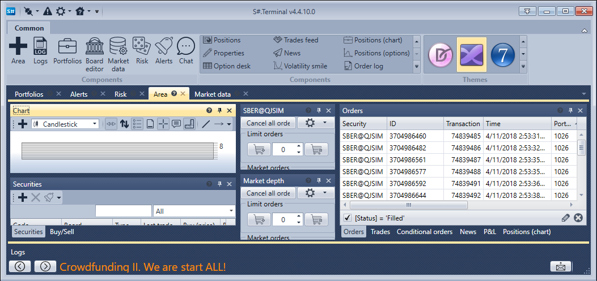

# リボン

[Terminal](../../terminal.md) ユーザーインターフェイスの主要な要素は、アプリケーションウィンドウ上部に配置されている **リボン** です。リボンを使用すると、必要なコマンドをすばやく見つけることができます。コマンドは論理的なグループに整理され、タブにまとめられています。必要なタブへ移動するには、その名前をクリックするだけです。各タブは、実行されるアクションの種類に関連付けられています。

起動後にデフォルトで開かれる **共通** タブには、作業の開始時に必要になる可能性がある要素が含まれています。**共通** タブでは、[ワークスペース](../../designer/user_interface/workspace.md)を追加したり、[ログ](../../designer/user_interface/logs.md)、[ポートフォリオ](../../designer/user_interface/portfolios.md)、[ボード](../../designer/user_interface/boards.md)を開いたり、[コンポーネント](../../designer/user_interface/components.md)を追加したりできます。また、**共通** タブでは、[Terminal](../../terminal.md) のテーマを選択できます。

## 推奨コンテンツ

[ワークスペース](../../designer/user_interface/workspace.md)
