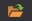

# UDP Dumper

**UDPDumper** は UDP パケットを記録します。ブローカーや取引所から提供されたネットワーク設定の検証や、[FAST](api/connectors/common/fast_protocol.md) や SBE などの UDP ベースのコネクターを後でテストするためのデータ収集に使用できます。

[インストーラー](installer.md) から UDPDumper をインストールします。

## セットアップと実行

1. 初回起動時、アプリは次のように表示されます:
2. ネットワークフィードを追加するには、手動で追加するか、取引所の設定ファイルからすべてのフィードを読み込みます。これを行うには、次のボタンをクリックします:
3. 表示されたウィンドウで、取引所の目的の設定ファイルを見つけて開く必要があります:
4. IP アドレスとポート設定を持つすべてのフィードがファイルから読み込まれます:
5. 必要なフィードを選択し、ダウンロード開始ボタンをクリックします:
6. 設定が正しければ、プログラムは UDP データグラムの受信を開始し、ディスクへ書き込みます。アプリは各フィードで受信したバイト数を表示します:
7. **UDPDumper** にはグラフィカルインターフェイスがあります。Linux などでグラフィカルインターフェイスなしで実行する必要がある場合は、クロスプラットフォームのコンソール版である **UDPDumper.Console** を使用します。

   アプリ **UDPDumper.Console** は、UI 版で作成されたファイルへのパスをパラメーターとして受け取ります（正確には UI 版であり、**取引所設定ではありません**）:

   ```cs
   		StockSharp.UdpDumper.Console.exe settings.json
   		
   ```
8. 収集したデータでコネクターをテストするには、ダンプモードを使用します。詳細については、[ダンプモード](api/connectors/common/fast_protocol/dump_mode.md) を参照してください。
