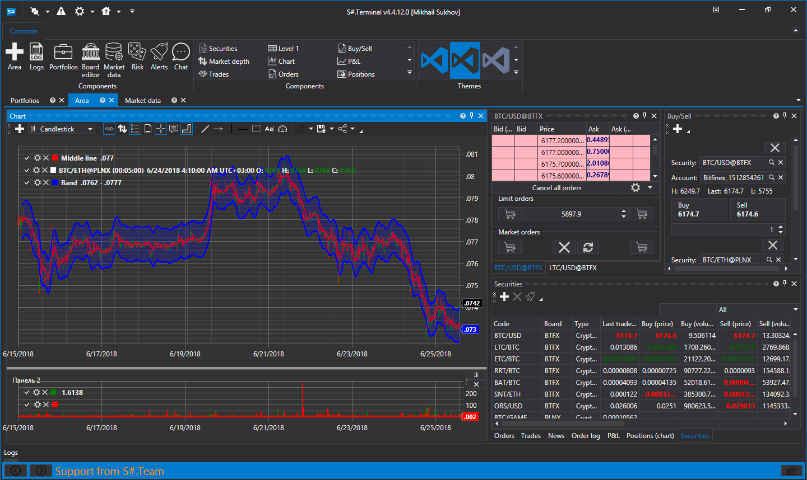

# Sobre o StockSharp

[StockSharp (S#)](https://stocksharp.com/pt/store/) fornece aplicações de negociação **gratuitas** para mercados globais, incluindo ações, futuros, opções, criptomoedas e forex. Você pode negociar manualmente ou executar estratégias automatizadas, desde robôs de negociação convencionais até sistemas HFT (negociação de alta frequência).

**Suporta mais de 90 corretoras, bolsas e fontes de dados:** [Conectores](topics/api/connectors.md).

O S# funciona com qualquer corretora, bolsa ou fonte de dados suportada pelos conectores disponíveis.

> [!NOTE]
> Todos os programas são instalados através do utilitário [Installer](topics/installer.md).

### Designer

O [Designer](topics/designer.md) é uma aplicação universal para criar estratégias de negociação algorítmica:

- Designer visual de estratégias com edição baseada no mouse.
- Editor [C#](https://en.wikipedia.org/wiki/C_Sharp_(programming_language)) integrado.
- Criação simples de indicadores personalizados.
- Depurador integrado.
- Conexões a múltiplas bolsas, praças de negociação e corretoras.
- Compatibilidade com mercados globais.
- Capacidade de compartilhar esquemas de estratégias com a sua equipe.

[Mais...](topics/designer.md)

### Hydra

O [Hydra](topics/hydra.md) baixa automaticamente dados de mercado históricos e em tempo real:

- Suporta muitas fontes de dados através dos [Conectores](topics/api/connectors.md).
- Alta taxa de compressão (2 bytes por negociação, 7 bytes por livro de ofertas).
- Trata qualquer tipo de dado (velas, ticks, livros de ofertas, registos de ordens, opções, notícias e mais).
- Acesso via API aos dados armazenados.
- Capacidades de exportação para CSV, Excel, XML ou bancos de dados.
- Funcionalidade de importação de CSV.
- Tarefas agendadas e sincronização automática pela Internet entre instâncias do Hydra em execução.

[Mais...](topics/hydra.md)

### Terminal

O [Terminal](topics/terminal.md) é uma aplicação de negociação e gráficos (terminal de negociação):

- Permite negociar diretamente a partir dos gráficos com um clique.
- Suporta períodos arbitrários.
- Apresenta vários tipos de vela: Volume, Tick, Range, Renko.
- Inclui gráficos de cluster e box.

### Shell

O Shell fornece uma estrutura gráfica pronta que pode ser rapidamente personalizada de acordo com as suas necessidades e vem com código-fonte totalmente aberto em C#:

- Código-fonte completo incluído.
- Suporta todas as conexões da plataforma StockSharp: FIX/FAST, Bolsas de Criptomoedas (+30 atualmente), etc.
- Suporte a esquemas do Designer.
- Interface de usuário flexível.
- Ferramentas de teste de estratégias (estatísticas, equity, relatórios).
- Salvar e carregar configurações de estratégias.
- Execução simultânea de estratégias.
- Informações detalhadas sobre o desempenho das estratégias (ordens, transações, posições, receita, registos, etc.).
- Lançamentos agendados de estratégias.

### API

A [API](topics/api.md) é uma biblioteca C# para desenvolvimento profissional de robôs de negociação e sistemas de negociação algorítmica.

### Nossos Produtos

- [Designer](topics/designer.md) - Designer universal de estratégias algorítmicas.
- [Hydra](topics/hydra.md) - Programa de transferência de dados de mercado.
- [API](topics/api.md) - Biblioteca para desenvolvimento de robôs de negociação em [C#](https://en.wikipedia.org/wiki/C_Sharp_(programming_language)).
- [Terminal](topics/terminal.md) - Terminal de negociação.
- [Shell](topics/shell.md) - Estrutura gráfica pronta para estratégias com código-fonte.
- [MATLAB](topics/matlab.md) - Integração do MATLAB com sistemas de negociação. Negocie a partir de scripts do MATLAB.

[Transferir](https://stocksharp.com/pt/products/download/)

## Conteúdo Recomendado

[Materiais de referência](topics/common/reference_materials.md)
