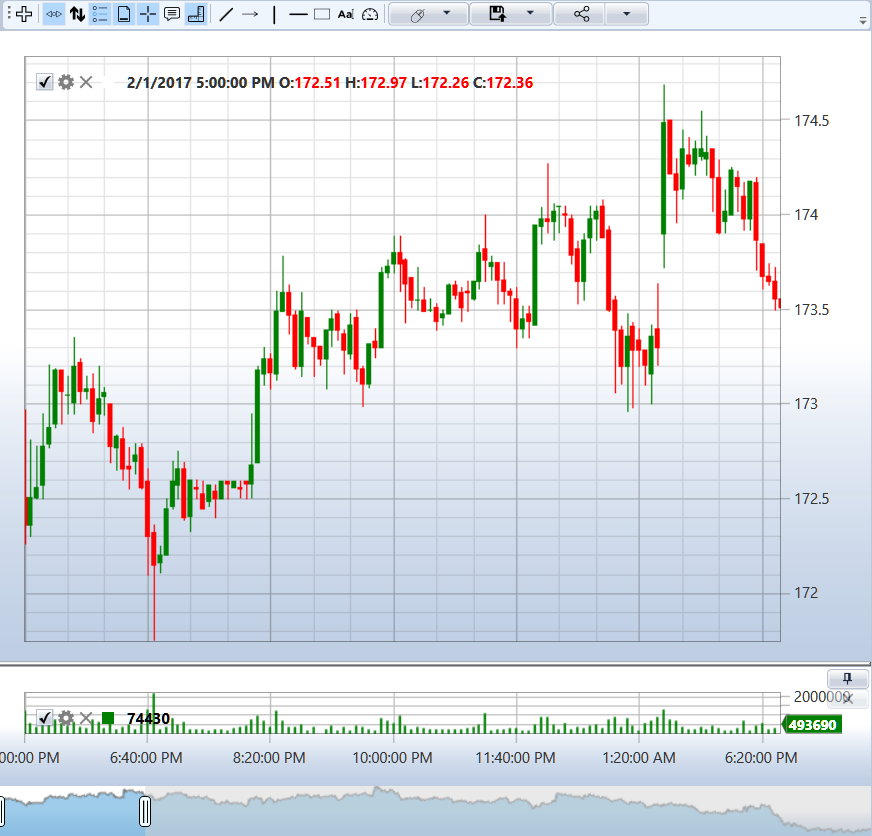

# Velas

O [S#](../api.md) suporta os seguintes tipos de velas:

- [TimeFrameCandleMessage](xref:StockSharp.Messages.TimeFrameCandleMessage) - uma vela baseada em um intervalo de tempo. Você pode definir tanto intervalos populares (minutos, horas, diário) quanto personalizados. Por exemplo, 21 segundos, 4,5 minutos, etc.
- [RangeCandleMessage](xref:StockSharp.Messages.RangeCandleMessage) - uma vela de faixa de preço. Uma nova vela é criada quando aparece uma negociação com um preço que excede os limites aceitáveis. O limite aceitável é formado a cada vez com base no preço da primeira negociação.
- [VolumeCandleMessage](xref:StockSharp.Messages.VolumeCandleMessage) - uma vela é formada até que o volume total de negociações exceda um limite especificado. Se uma nova negociação exceder o volume permitido, ela é incluída em uma nova vela.
- [TickCandleMessage](xref:StockSharp.Messages.TickCandleMessage) - o mesmo que [VolumeCandleMessage](xref:StockSharp.Messages.VolumeCandleMessage), mas o número de negociações é usado como limitação em vez do volume.
- [PnFCandleMessage](xref:StockSharp.Messages.PnFCandleMessage) - uma vela de gráfico ponto-e-figura (gráfico X-O).
- [RenkoCandleMessage](xref:StockSharp.Messages.RenkoCandleMessage) - vela Renko.

Como trabalhar com velas é mostrado no exemplo localizado na pasta *Samples\/02\_Candles\/01\_Realtime*.

As imagens a seguir mostram os gráficos [TimeFrameCandleMessage](xref:StockSharp.Messages.TimeFrameCandleMessage) e [RangeCandleMessage](xref:StockSharp.Messages.RangeCandleMessage):




## Iniciando a Obtenção de Dados

1. Para obter velas, crie uma assinatura usando a classe [Subscription](xref:StockSharp.BusinessEntities.Subscription):

```cs
// Criar uma assinatura para velas de 5 minutos
var subscription = new Subscription(
	DataType.TimeFrame(TimeSpan.FromMinutes(5)),  // Tipo de dados com especificação do período
	security)  // Instrumento
{
	// Configurar parâmetros adicionais pela propriedade MarketData
	MarketData =
	{
		// Período para o qual solicitamos dados históricos (últimos 30 dias)
		From = DateTime.Today.Subtract(TimeSpan.FromDays(30)),
		To = DateTime.Now
	}
};
```

2. Para receber velas, assine o evento [Connector.CandleReceived](xref:StockSharp.Algo.Connector.CandleReceived), que sinaliza o aparecimento de um novo valor para processamento:

```cs
// Assinar o evento de recebimento de velas
_connector.CandleReceived += OnCandleReceived;

// Manipulador do evento de recebimento de velas
private void OnCandleReceived(Subscription subscription, ICandleMessage candle)
{
	// Aqui subscription é o objeto de assinatura que criamos
	// vela recebida

	// Verificar se a vela pertence à nossa assinatura
	if (subscription == _candleSubscription)
	{
		// Desenhar a vela no gráfico
		Chart.Draw(_candleElement, candle);
	}
}
```

> [!TIP]
> O componente gráfico [Chart](xref:StockSharp.Xaml.Charting.Chart) é usado para exibir velas.

3. Em seguida, inicie a assinatura através do método [Connector.Subscribe](xref:StockSharp.Algo.Connector.Subscribe(StockSharp.BusinessEntities.Subscription)):

```cs
// Iniciar a assinatura
_connector.Subscribe(subscription);
```

Depois disso, o evento [Connector.CandleReceived](xref:StockSharp.Algo.Connector.CandleReceived) começará a ser chamado.

4. O evento [Connector.CandleReceived](xref:StockSharp.Algo.Connector.CandleReceived) é chamado não apenas quando uma nova vela aparece, mas também quando a atual é alterada.

Se você precisar exibir apenas velas **"completas"**, você precisa verificar a propriedade [ICandleMessage.State](xref:StockSharp.Messages.ICandleMessage.State) da vela recebida:

```cs
private void OnCandleReceived(Subscription subscription, ICandleMessage candle)
{
	// Verificar se a vela pertence à nossa assinatura
	if (subscription != _candleSubscription)
		return;

	// Verificar se a vela está concluída
	if (candle.State == CandleStates.Finished)
	{
		// Criar dados para desenho
		var chartData = new ChartDrawData();
		chartData.Group(candle.OpenTime).Add(_candleElement, candle);

		// Desenhar a vela no gráfico
		this.GuiAsync(() => Chart.Draw(chartData));
	}
}
```

5. Parâmetros adicionais podem ser configurados para a assinatura:

- **Modo de construção de velas** - determina se dados prontos serão solicitados ou construídos a partir de outro tipo de dado:

```cs
// Solicitar apenas dados prontos
subscription.MarketData.BuildMode = MarketDataBuildModes.Load;

// Construir apenas a partir de outro tipo de dados
subscription.MarketData.BuildMode = MarketDataBuildModes.Build;

// Solicitar dados prontos e, se não estiverem disponíveis, construí-los
subscription.MarketData.BuildMode = MarketDataBuildModes.LoadAndBuild;
```

- **Fonte para construção de velas** - indica a partir de qual tipo de dado construir velas se eles não estiverem diretamente disponíveis:

```cs
// Construção de velas a partir de negociações tick
subscription.MarketData.BuildFrom = DataType.Ticks;

// Construção de velas a partir do livro de ofertas
subscription.MarketData.BuildFrom = DataType.MarketDepth;

// Construção de velas a partir de Level1
subscription.MarketData.BuildFrom = DataType.Level1;
```

- **Campo para construção de velas** - deve ser especificado para determinados tipos de dados:

```cs
// Construção de velas a partir do melhor preço bid em Level1
subscription.MarketData.BuildField = Level1Fields.BestBidPrice;

// Construção de velas a partir do melhor preço ask em Level1
subscription.MarketData.BuildField = Level1Fields.BestAskPrice;

// Construção de velas a partir do meio do spread no livro de ofertas
subscription.MarketData.BuildField = Level1Fields.SpreadMiddle;
```

- **Perfil de volume** - cálculo do perfil de volume para velas:

```cs
// Ativar o cálculo do perfil de volume
subscription.MarketData.IsCalcVolumeProfile = true;
```

## Exemplos de Assinaturas para Diferentes Tipos de Vela

### Velas com período padrão

```cs
// Velas de 5 minutos
var timeFrameSubscription = new Subscription(
	DataType.TimeFrame(TimeSpan.FromMinutes(5)),
	security);
_connector.Subscribe(timeFrameSubscription);
```

### Carregar apenas velas históricas

```cs
// Carregar apenas velas históricas sem transição para tempo real
var historicalSubscription = new Subscription(
	DataType.TimeFrame(TimeSpan.FromMinutes(5)),
	security)
{
	MarketData =
	{
		From = DateTime.Today.Subtract(TimeSpan.FromDays(30)),
		To = DateTime.Today,  // Especificar data final
		BuildMode = MarketDataBuildModes.Load  // Carregar apenas dados já prontos
	}
};
_connector.Subscribe(historicalSubscription);
```

### Construindo velas de período não padrão a partir de ticks

```cs
// Velas com período de 21 segundos construídas a partir de ticks
var customTimeFrameSubscription = new Subscription(
	DataType.TimeFrame(TimeSpan.FromSeconds(21)),
	security)
{
	MarketData =
	{
		BuildMode = MarketDataBuildModes.Build,
		BuildFrom = DataType.Ticks
	}
};
_connector.Subscribe(customTimeFrameSubscription);
```

### Construir velas a partir de dados do livro de ofertas

```cs
// Velas construídas a partir do meio do spread no livro de ofertas
var depthBasedSubscription = new Subscription(
	DataType.TimeFrame(TimeSpan.FromMinutes(1)),
	security)
{
	MarketData =
	{
		BuildMode = MarketDataBuildModes.Build,
		BuildFrom = DataType.MarketDepth,
		BuildField = Level1Fields.SpreadMiddle
	}
};
_connector.Subscribe(depthBasedSubscription);
```

### Velas com perfil de volume

```cs
// Velas de 5 minutos com cálculo do perfil de volume
var volumeProfileSubscription = new Subscription(
	DataType.TimeFrame(TimeSpan.FromMinutes(5)),
	security)
{
	MarketData =
	{
		BuildMode = MarketDataBuildModes.LoadAndBuild,
		BuildFrom = DataType.Ticks,
		IsCalcVolumeProfile = true
	}
};
_connector.Subscribe(volumeProfileSubscription);
```

### Velas de volume

```cs
// Velas de volume (cada vela contém volume de 1000 contratos)
var volumeCandleSubscription = new Subscription(
	DataType.Volume(1000m),  // Especificar tipo de vela e volume
	security)
{
	MarketData =
	{
		BuildMode = MarketDataBuildModes.Build,
		BuildFrom = DataType.Ticks
	}
};
_connector.Subscribe(volumeCandleSubscription);
```

### Velas de contagem de ticks

```cs
// Velas por contagem de ticks (cada vela contém 1000 negociações)
var tickCandleSubscription = new Subscription(
	DataType.Tick(1000),  // Especificar tipo de vela e número de negócios
	security)
{
	MarketData =
	{
		BuildMode = MarketDataBuildModes.Build,
		BuildFrom = DataType.Ticks
	}
};
_connector.Subscribe(tickCandleSubscription);
```

### Velas de faixa de preço

```cs
// Velas de faixa de preço com intervalo de 0,1 unidade
var rangeCandleSubscription = new Subscription(
	DataType.Range(0.1m),  // Especificar tipo de vela e intervalo de preço
	security)
{
	MarketData =
	{
		BuildMode = MarketDataBuildModes.Build,
		BuildFrom = DataType.Ticks
	}
};
_connector.Subscribe(rangeCandleSubscription);
```

### Velas Renko

```cs
// Velas Renko com passo de 0,1
var renkoCandleSubscription = new Subscription(
	DataType.Renko(0.1m),  // Especificar tipo de vela e tamanho do bloco
	security)
{
	MarketData =
	{
		BuildMode = MarketDataBuildModes.Build,
		BuildFrom = DataType.Ticks
	}
};
_connector.Subscribe(renkoCandleSubscription);
```

### Velas ponto e figura (P&F)

```cs
// Velas ponto e figura
var pnfCandleSubscription = new Subscription(
	DataType.PnF(new PnfArg { BoxSize = 0.1m, ReversalAmount = 1 }),  // Especificar parâmetros P&F
	security)
{
	MarketData =
	{
		BuildMode = MarketDataBuildModes.Build,
		BuildFrom = DataType.Ticks
	}
};
_connector.Subscribe(pnfCandleSubscription);
```

## Próximos Passos

[Gráfico](candles/chart.md)

[Tipo personalizado de vela](candles/custom_type_of_candle.md)
