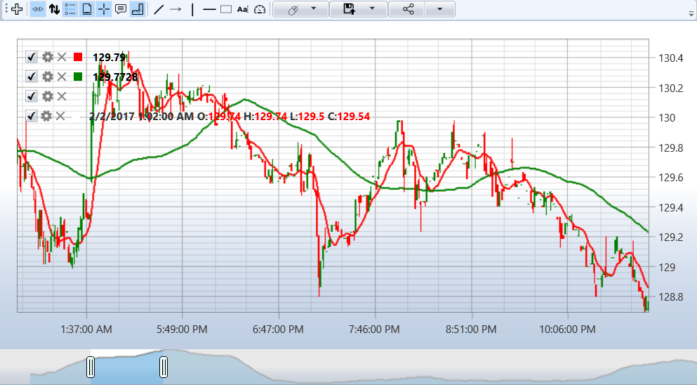

# Gráfico

Para exibição gráfica de candles, você pode usar o componente especial [Chart](xref:StockSharp.Xaml.Charting.Chart) (veja [Componentes para construção de gráficos](../graphical_user_interface/charts.md)), que renderiza candles da seguinte forma:



## Abordagem básica para exibir velas

Existem duas abordagens para exibir candles em um gráfico. A primeira abordagem é o desenho manual dos candles ao receber dados:

```cs
// CandlesChart - StockSharp.Xaml.Chart
private ChartArea _areaComb;
private ChartCandleElement _candleElement;

// Inicialização do gráfico
private void InitializeChart()
{
	// Criar área do gráfico
	_areaComb = new ChartArea();
	_chart.Areas.Add(_areaComb);

	// Criar elemento do gráfico que representa velas
	_candleElement = new ChartCandleElement() { FullTitle = "Velas" };
	_areaComb.Elements.Add(_candleElement);

	// Assinar o evento de recebimento de velas
	_connector.CandleReceived += OnCandleReceived;
}

// Criar assinatura de velas de 5 minutos
private void SubscribeToCandles()
{
	var subscription = new Subscription(
		DataType.TimeFrame(TimeSpan.FromMinutes(5)),
		_security)
	{
		MarketData =
		{
			// Solicitar dados históricos de 5 dias
			From = DateTime.Today.Subtract(TimeSpan.FromDays(5)),
			To = DateTime.Now
		}
	};

	// Iniciar assinatura
	_connector.Subscribe(subscription);
}

// Manipulador do evento de recebimento de velas
private void OnCandleReceived(Subscription subscription, ICandleMessage candle)
{
	// Verificar se a vela está concluída
	if (candle.State == CandleStates.Finished)
	{
		// Criar dados para desenho
		var chartData = new ChartDrawData();
		chartData.Group(candle.OpenTime).Add(_candleElement, candle);

		// Desenhar no gráfico na thread de UI
		this.GuiAsync(() => _chart.Draw(chartData));
	}
}
```

## Vinculação Automática de Assinatura ao Elemento do Gráfico

A segunda abordagem é usar a vinculação automática de assinatura ao elemento do gráfico. Isso permite exibir automaticamente os dados recebidos:

```cs
// Inicialização do gráfico com vinculação automática
private void InitializeChartWithAutoBinding()
{
	// Criar área do gráfico
	var area = new ChartArea();
	_chart.Areas.Add(area);

	// Criar elemento para exibir velas
	var candleElement = new ChartCandleElement();

	// Criar assinatura de velas
	var subscription = new Subscription(
		DataType.TimeFrame(TimeSpan.FromMinutes(5)),
		_security)
	{
		MarketData =
		{
			From = DateTime.Today.Subtract(TimeSpan.FromDays(5)),
			To = DateTime.Now
		}
	};

	// Vincular elemento à assinatura
	_chart.AddElement(area, candleElement, subscription);

	// Iniciar assinatura
	_connector.Subscribe(subscription);
}
```

## Trabalhando com Indicadores

Para exibir indicadores no gráfico junto com os candles, são usados elementos do tipo [ChartIndicatorElement](xref:StockSharp.Xaml.Charting.ChartIndicatorElement):

```cs
// Adicionar indicador ao gráfico
private void AddIndicatorToChart()
{
	// Criar elemento para o indicador
	var smaElement = new ChartIndicatorElement
	{
		Title = "SMA (14)",
		Color = Colors.Red
	};

	// Adicionar elemento à mesma área das velas
	_areaComb.Elements.Add(smaElement);

	// Criar indicador
	var sma = new SimpleMovingAverage { Length = 14 };

	// Assinar o evento de recebimento de velas para calcular o indicador
	_connector.CandleReceived += (subscription, candle) =>
	{
		// Calcular valor do indicador
		var indicatorValue = sma.Process(candle);

		// Desenhar valor no gráfico
		var chartData = new ChartDrawData();
		chartData.Group(candle.OpenTime).Add(smaElement, indicatorValue);

		this.GuiAsync(() => _chart.Draw(chartData));
	};
}
```

## Exibindo Múltiplos Indicadores em Áreas Diferentes

Os indicadores podem ser colocados em áreas separadas do gráfico:

```cs
// Adicionar indicadores a áreas diferentes
private void AddIndicatorsToSeparateAreas()
{
	// Área principal para velas
	var candleArea = new ChartArea();
	_chart.Areas.Add(candleArea);

	// Elemento para velas
	var candleElement = new ChartCandleElement();
	candleArea.Elements.Add(candleElement);

	// Elemento para SMA na mesma área
	var smaElement = new ChartIndicatorElement { Title = "SMA (14)" };
	candleArea.Elements.Add(smaElement);

	// Área separada para RSI
	var rsiArea = new ChartArea();
	_chart.Areas.Add(rsiArea);

	// Elemento para RSI
	var rsiElement = new ChartIndicatorElement { Title = "RSI (14)" };
	rsiArea.Elements.Add(rsiElement);

	// Criar indicadores
	var sma = new SimpleMovingAverage { Length = 14 };
	var rsi = new RelativeStrengthIndex { Length = 14 };

	// Assinatura de velas
	var subscription = new Subscription(
		DataType.TimeFrame(TimeSpan.FromMinutes(5)),
		_security);

	// Vincular elemento de vela à assinatura
	_chart.AddElement(candleArea, candleElement, subscription);

	// Iniciar assinatura e processar indicadores
	_connector.Subscribe(subscription);

	_connector.CandleReceived += (sub, candle) =>
	{
		if (sub != subscription || candle.State != CandleStates.Finished)
			return;

		// Calcular valores do indicador
		var smaValue = sma.Process(candle);
		var rsiValue = rsi.Process(candle);

		// Desenhar valores no gráfico
		var chartData = new ChartDrawData();
		chartData
			.Group(candle.OpenTime)
				.Add(smaElement, smaValue)
				.Add(rsiElement, rsiValue);

		this.GuiAsync(() => _chart.Draw(chartData));
	};
}
```

## Exibindo Ordens e Negociações no Gráfico

Elementos especiais são usados para exibir ordens e negociações no gráfico:

```cs
// Adicionar elementos para exibir ordens e negociações
private void AddOrdersAndTradesToChart()
{
	// Criar elementos para exibir ordens e negociações
	var orderElement = new ChartOrderElement();
	var tradeElement = new ChartTradeElement();

	// Adicionar elementos à área do gráfico
	_areaComb.Elements.Add(orderElement);
	_areaComb.Elements.Add(tradeElement);

	// Assinar eventos de recebimento de ordens e negociações
	_connector.OrderReceived += (subscription, order) =>
	{
		if (order.Security != _security)
			return;

		// Desenhar ordem no gráfico
		var chartData = new ChartDrawData();
		chartData.Group(order.Time).Add(orderElement, order);

		this.GuiAsync(() => _chart.Draw(chartData));
	};

	_connector.OwnTradeReceived += (subscription, trade) =>
	{
		if (trade.Order.Security != _security)
			return;

		// Desenhar negociação no gráfico
		var chartData = new ChartDrawData();
		chartData.Group(trade.Time).Add(tradeElement, trade);

		this.GuiAsync(() => _chart.Draw(chartData));
	};
}
```

## Configurando a Aparência do Gráfico

Vários aspectos da aparência do gráfico podem ser configurados:

```cs
// Configurar aparência do gráfico
private void ConfigureChartAppearance()
{
	// Configurar área do gráfico
	_areaComb.Height = 300;
	_areaComb.BackgroundMajorGridColor = Colors.Gray;
	_areaComb.BackgroundMinorGridColor = Colors.LightGray;

	// Configurar elemento de vela
	_candleElement.DrawStyle = ChartCandleDrawStyles.CandleStick;
	_candleElement.UpBrush = Brushes.Green;
	_candleElement.DownBrush = Brushes.Red;
	_candleElement.StrokeThickness = 1;

	// Configurar gráfico inteiro
	_chart.IsAutoRange = true;            // Escalamento automático
	_chart.IsManualVerticalValues = false; // Cálculo automático dos valores verticais
	_chart.BidEnabled = false;            // Desativar apresentação do melhor preço bid
	_chart.AskEnabled = false;            // Desativar apresentação do melhor preço ask
}
```

## Zoom e Rolagem do Gráfico

Gerenciando o zoom e a rolagem do gráfico:

```cs
// Configurar zoom e rolagem
private void ConfigureChartZoomAndScroll()
{
	// Definir datas inicial e final para exibição
	_chart.SetXRange(DateTime.Today.AddDays(-10), DateTime.Today);

	// Definir intervalo do eixo Y
	_chart.SetYRange(100, 150);

	// Botões para controle de zoom
	zoomInButton.Click += (s, e) => _chart.ZoomIn();
	zoomOutButton.Click += (s, e) => _chart.ZoomOut();

	// Botões para rolagem
	scrollLeftButton.Click += (s, e) => _chart.ScrollLeft();
	scrollRightButton.Click += (s, e) => _chart.ScrollRight();

	// Redefinir zoom para automático
	resetZoomButton.Click += (s, e) => _chart.IsAutoRange = true;
}
```

## Exportando o Gráfico para Imagem

Para salvar o gráfico em um arquivo:

```cs
// Exportar gráfico para imagem
private void ExportChartToImage()
{
	// Criar objeto para salvar a imagem
	var saveFileDialog = new SaveFileDialog
	{
		Filter = "Imagem PNG|*.png|Imagem JPEG|*.jpg|Imagem BMP|*.bmp",
		Title = "Salvar imagem do gráfico"
	};

	if (saveFileDialog.ShowDialog() == true)
	{
		// Criar imagem a partir do gráfico
		var rtb = new RenderTargetBitmap(
			(int)_chart.ActualWidth,
			(int)_chart.ActualHeight,
			96, 96,
			PixelFormats.Pbgra32);

		rtb.Render(_chart);

		// Salvar imagem no formato selecionado
		BitmapEncoder encoder;

		switch (Path.GetExtension(saveFileDialog.FileName).ToLower())
		{
			case ".jpg":
				encoder = new JpegBitmapEncoder();
				break;
			case ".bmp":
				encoder = new BmpBitmapEncoder();
				break;
			default:
				encoder = new PngBitmapEncoder();
				break;
		}

		encoder.Frames.Add(BitmapFrame.Create(rtb));

		using (var fileStream = new FileStream(saveFileDialog.FileName, FileMode.Create))
		{
			encoder.Save(fileStream);
		}
	}
}
```

## Limpando o Gráfico

Para limpar os dados no gráfico:

```cs
// Limpar gráfico ou seus elementos
private void ClearChart()
{
	// Limpar gráfico inteiro
	_chart.Reset();

	// Limpar área específica
	_areaComb.Reset();

	// Limpar elemento específico
	_candleElement.Reset();
}
```

Um exemplo de exibição de candles em um gráfico é fornecido na seção [Velas](../candles.md).

## Veja também

[Componentes para construção de gráficos](../graphical_user_interface/charts.md)
