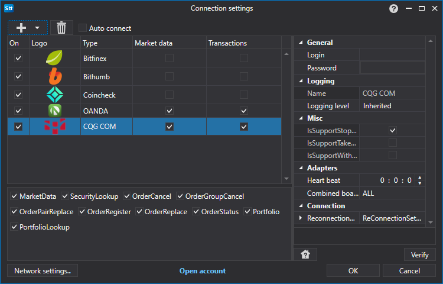

# Conectores

Para trabalhar com bolsas e fontes de dados no [S#](../api.md), recomenda-se usar a classe base [Connector](xref:StockSharp.Algo.Connector).

Vamos examinar o trabalho com [Connector](xref:StockSharp.Algo.Connector). O código-fonte do exemplo pode ser encontrado no projeto Samples\/01\_Basic\/01\_ConnectAndDownloadInstruments.


Crie uma instância da classe [Connector](xref:StockSharp.Algo.Connector):

```cs
...
public Connector Connector;
...
public MainWindow()
{
	InitializeComponent();
	Connector = new Connector();
	InitConnector();
}

```

Para configurar o [Connector](xref:StockSharp.Algo.Connector), a **API** possui uma interface gráfica especial que permite configurar várias conexões simultaneamente. Como usá-la é descrito na seção [Configuração Gráfica](connectors/graphical_configuration.md).

```cs
...
private readonly IFileSystem _fileSystem = Paths.FileSystem;
private const string _connectorFile = "ConnectorFile.json";
...
private void Setting_Click(object sender, RoutedEventArgs e)
{
	if (Connector.Configure(this))
	{
		Connector.Save().Serialize(_fileSystem, _connectorFile);
	}
}

```



Da mesma forma, você pode adicionar conexões diretamente pelo código (sem janelas gráficas) usando o método de extensão [TraderHelper.AddAdapter\<TAdapter\>](xref:StockSharp.Algo.TraderHelper.AddAdapter``1(StockSharp.Algo.Connector,System.Action{``0}))**(**[StockSharp.Algo.Connector](xref:StockSharp.Algo.Connector) connector, [System.Action\<TAdapter\>](xref:System.Action`1) init **)**:

```cs
...
// Add adapter for connecting to Binance
connector.AddAdapter<BinanceMessageAdapter>(a =>
{
	a.Key = "<Your API Key>";
	a.Secret = "<Your Secret Key>";
});

// Add RSS for news
connector.AddAdapter<RssMessageAdapter>(a =>
{
	a.Address = "https://news-source.com/feed";
});

```

Você pode adicionar um número ilimitado de conexões a um único objeto [Connector](xref:StockSharp.Algo.Connector). Assim, é possível conectar-se simultaneamente a várias bolsas e corretoras a partir do programa.

No método *InitConnector*, definimos os manipuladores de eventos necessários para [IConnector](xref:StockSharp.BusinessEntities.IConnector):

```cs
private void InitConnector()
{
	// Subscribe to successful connection event
	Connector.Connected += () =>
	{
		this.GuiAsync(() => ChangeConnectStatus(true));
	};

	// Subscribe to connection error event
	Connector.ConnectionError += error => this.GuiAsync(() =>
	{
		ChangeConnectStatus(false);
		MessageBox.Show(this, error.ToString(), LocalizedStrings.ErrorConnection);
	});

	// Subscribe to disconnection event
	Connector.Disconnected += () => this.GuiAsync(() => ChangeConnectStatus(false));

	// Subscribe to error event
	Connector.Error += error =>
		this.GuiAsync(() => MessageBox.Show(this, error.ToString(), LocalizedStrings.Str2955));

	// Subscribe to market data subscription failure event
	Connector.SubscriptionFailed += (subscription, error, isSubscribe) =>
		this.GuiAsync(() => MessageBox.Show(this, error.ToString(),
			LocalizedStrings.Str2956Params.Put(subscription.DataType, subscription.SecurityId)));

	// Subscriptions for data reception

	// Instruments
	Connector.SecurityReceived += (sub, security) => _securitiesWindow.SecurityPicker.Securities.Add(security);

	// Tick trades
	Connector.TickTradeReceived += (sub, trade) => _tradesWindow.TradeGrid.Trades.TryAdd(trade);

	// Orders
	Connector.OrderReceived += (sub, order) => _ordersWindow.OrderGrid.Orders.TryAdd(order);

	// Own trades
	Connector.OwnTradeReceived += (sub, trade) => _myTradesWindow.TradeGrid.Trades.TryAdd(trade);

	// Positions
	Connector.PositionReceived += (sub, position) => _portfoliosWindow.PortfolioGrid.Positions.TryAdd(position);

	// Order registration failures
	Connector.OrderRegisterFailReceived += (sub, fail) => _ordersWindow.OrderGrid.AddRegistrationFail(fail);

	// Order cancellation failures
	Connector.OrderCancelFailReceived += (sub, fail) => OrderFailed(fail);

	// Set market data provider
	_securitiesWindow.SecurityPicker.MarketDataProvider = Connector;

	try
	{
		if (File.Exists(_connectorFile))
		{
			var ctx = new ContinueOnExceptionContext();
			ctx.Error += ex => ex.LogError();
			using (new Scope<ContinueOnExceptionContext>(ctx))
				Connector.Load(_connectorFile.Deserialize<SettingsStorage>(_fileSystem));
		}
	}
	catch
	{
	}

	ConfigManager.RegisterService<IExchangeInfoProvider>(new InMemoryExchangeInfoProvider());

	// Register adapter provider for graphical configuration
	ConfigManager.RegisterService<IMessageAdapterProvider>(
		new InMemoryMessageAdapterProvider(Connector.Adapter.InnerAdapters));
}
```

Como salvar e carregar configurações do [Connector](xref:StockSharp.Algo.Connector) em um arquivo pode ser encontrado na seção [Salvando e Carregando Configurações](connectors/save_and_load_settings.md).

Informações sobre a criação do seu próprio [Connector](xref:StockSharp.Algo.Connector) podem ser encontradas na seção [Criando Seu Próprio Conector](connectors/creating_own_connector.md).

O envio de ordens é descrito nas seções [Ordens](orders_management.md), [Criando uma Nova Ordem](orders_management/create_new_order.md), [Criando uma Nova Ordem Stop](orders_management/create_new_stop_order.md).

## Recursos adicionais

### IFileSystem e Paths.FileSystem

Use `IFileSystem` para operações de arquivo, como serializar e desserializar configurações. A instância padrão está disponível através de `Paths.FileSystem`:

```cs
private readonly IFileSystem _fileSystem = Paths.FileSystem;
```

Os métodos `Serialize` e `Deserialize` sem o parâmetro `IFileSystem` estão marcados como `[Obsolete]`.

### Métodos assíncronos de ordens

Os seguintes métodos assíncronos estão disponíveis para trabalhar com ordens:

- `RegisterOrderAsync` - registra uma ordem de forma assíncrona.
- `CancelOrderAsync` - cancela uma ordem de forma assíncrona.
- `EditOrderAsync` - edita uma ordem de forma assíncrona.

### SubscriptionsOnConnect

A propriedade `SubscriptionsOnConnect` controla as assinaturas que são realizadas automaticamente na conexão. Por padrão, inclui assinaturas de instrumentos, portfólios e ordens.

### Eventos do adaptador

Os seguintes eventos estão disponíveis para rastrear eventos de adaptadores específicos:

- `ConnectedEx` - um adaptador específico se conectou.
- `DisconnectedEx` - um adaptador específico se desconectou.
- `ConnectionErrorEx` - ocorreu um erro de conexão em um adaptador específico.

### Ciclo de vida da assinatura

- `SubscriptionStarted` - a assinatura foi iniciada.
- `SubscriptionOnline` - a assinatura mudou para o estado online: os dados históricos foram recebidos e a transmissão de dados em tempo real foi iniciada.
- `SubscriptionFailed` - erro de assinatura. O terceiro parâmetro, `isSubscribe`, indica se o erro ocorreu durante a assinatura ou o cancelamento da assinatura.
- `SubscriptionStopped` - a assinatura foi interrompida.

## Veja também

[Configuração Gráfica](connectors/graphical_configuration.md)
