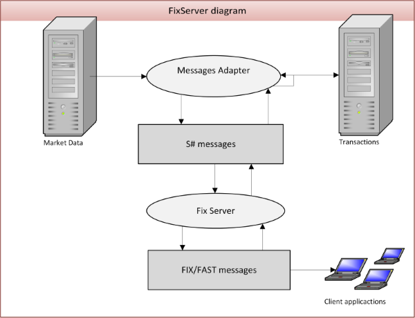

# Servidor FIX

O [FixServer](xref:StockSharp.Server.Fix.FixServer) permite criar seus próprios servidores FIX que utilizam os protocolos internacionais [FIX](https://en.wikipedia.org/wiki/Financial_Information_eXchange)\/[FAST](https://en.wikipedia.org/wiki/FAST_protocol). Ele usa o FIX 4.4 para transações e o FAST para dados de mercado. O esquema do servidor é mostrado na figura a seguir:

