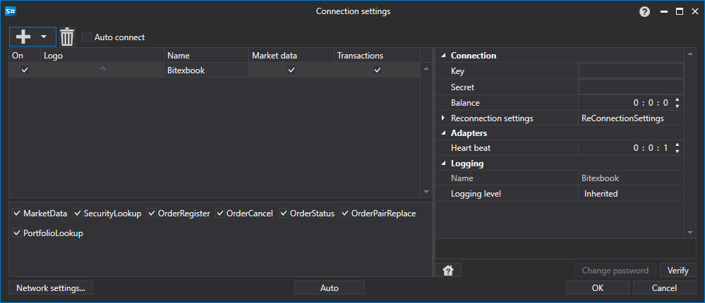

# Configuração gráfica Bitexbook

Para todos os produtos [S#](../../../../api.md), a configuração gráfica da conexão é realizada na [Janela de configurações de conexão](../../../graphical_user_interface/connection_settings_window.md):

- **Key** - Chave.
- **Secret** - Segredo.
- **Balance** - Intervalo de verificação de saldo. Necessário em caso de ações de depósito e saque.
- **Intervalo de verificação da ligação** - Intervalo de verificação do servidor para rastrear se a conexão está ativa. Por padrão, é de 1 minuto.
- **Definições de religação** - Mecanismo de rastreamento de conexões com as configurações do sistema de negociação. ([Configurações de reconexão](../../reconnection_settings.md))

## Conteúdo recomendado

[Conectores](../../../connectors.md)

[Configuração gráfica](../../graphical_configuration.md)

[Criar próprio conector](../../creating_own_connector.md)

[Salvar e carregar configurações](../../save_and_load_settings.md)
