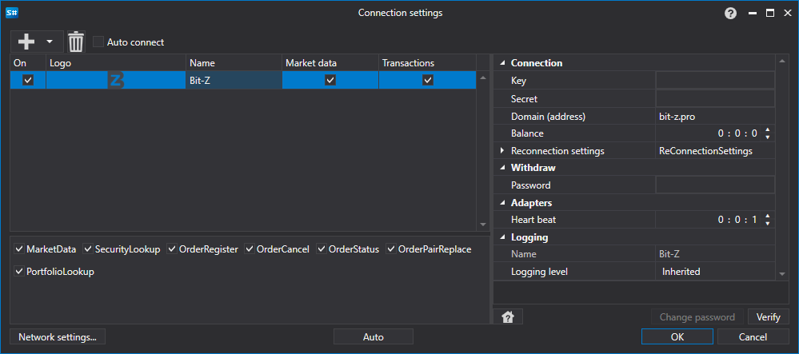

> [!WARNING]
> Esta bolsa encerrou permanentemente as operações (~2021 — encerrada). Este conector não está mais operacional. A documentação é mantida para referência histórica.

# Configuração gráfica BitZ

Para todos os produtos [S#](../../../../api.md), a configuração gráfica da conexão é realizada na [janela de configurações de conexão](../../../graphical_user_interface/connection_settings_window.md):

- **Key** - Chave.
- **Secret** - Chave secreta.
- **Domain (address)** - Endereço do domínio.
- **Balance** - Intervalo de verificação do saldo. Necessário em caso de ações de depósito e retirada.
- **Password** - Senha administrativa.
- **Heart beat** - Intervalo de verificação do servidor para rastrear se a conexão está ativa. Por padrão, igual a 1 minuto.
- **Reconnection settings** - Mecanismo de rastreamento de conexões com as configurações do sistema de negociação. ([Configurações de reconexão](../../reconnection_settings.md))

## Conteúdo recomendado

[Conectores](../../../connectors.md)

[Configuração gráfica](../../graphical_configuration.md)

[Criando Seu Próprio Conector](../../creating_own_connector.md)

[Salvar e carregar configurações](../../save_and_load_settings.md)
