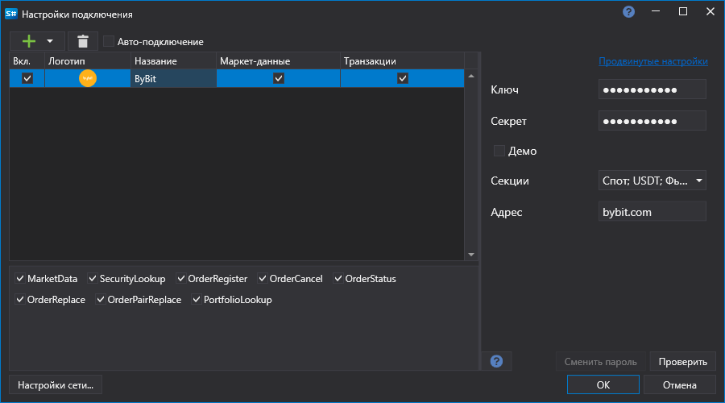

# Configuração gráfica de ByBit

Para todos os produtos [S#](../../../../api.md), a configuração gráfica da ligação é realizada na [Janela de definições de ligação](../../../graphical_user_interface/connection_settings_window.md):

- **chave** - Key.
- **segredo** - segredo da API.
- **Secções** - Secções de negociação.
- **Demonstração** - Ligação à negociação demo.

## Ver também

[Conectores](../../../connectors.md)

[Configuração gráfica](../../graphical_configuration.md)

[Criar o próprio conector](../../creating_own_connector.md)

[Guardar e carregar definições](../../save_and_load_settings.md)
