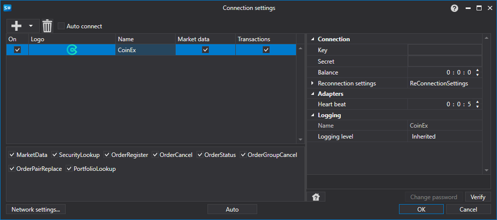

# Configuração gráfica CoinEx

Para todos os produtos [S#](../../../../api.md), a configuração gráfica da ligação é efetuada na [janela de definições de ligação](../../../graphical_user_interface/connection_settings_window.md):

- **Key** - Chave.
- **Secret** - Segredo.
- **Balance** - Intervalo de verificação do saldo. Necessário em caso de operações de depósito e levantamento.
- **Heart beat** - Intervalo de verificação do servidor para acompanhar se a ligação está ativa. Por defeito, é igual a 1 minuto.
- **Reconnection settings** - Mecanismo para acompanhar ligações com as definições do sistema de negociação. ([Definições de reconexão](../../reconnection_settings.md))

## Conteúdo recomendado

[Conectores](../../../connectors.md)

[Configuração gráfica](../../graphical_configuration.md)

[Criar o próprio conector](../../creating_own_connector.md)

[Guardar e carregar definições](../../save_and_load_settings.md)

