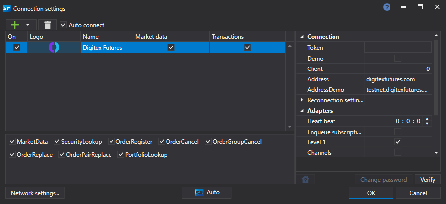

> [!CAUTION]
> **A bolsa Digitex Futures encerrou as operações. O conector não funciona mais; a documentação é mantida apenas para referência.**

# Configuração gráfica DigitexFutures

Para todos os produtos [S#](../../../../api.md), a configuração gráfica da ligação é realizada na [Janela de definições de ligação](../../../graphical_user_interface/connection_settings_window.md):

- **chave** - Key.
- **segredo** - segredo da API.
- **Intervalo de verificação da ligação** - Intervalo de verificação do servidor para monitorizar se a ligação está ativa. Por defeito é de 1 minuto.
- **Definições de religação** - Mecanismo de monitorização das ligações com as definições do sistema de negociação. ([Definições de reconexão](../../reconnection_settings.md))

## Conteúdo recomendado

[Conectores](../../../connectors.md)

[Configuração gráfica](../../graphical_configuration.md)

[Criar o próprio conector](../../creating_own_connector.md)

[Guardar e carregar definições](../../save_and_load_settings.md)
