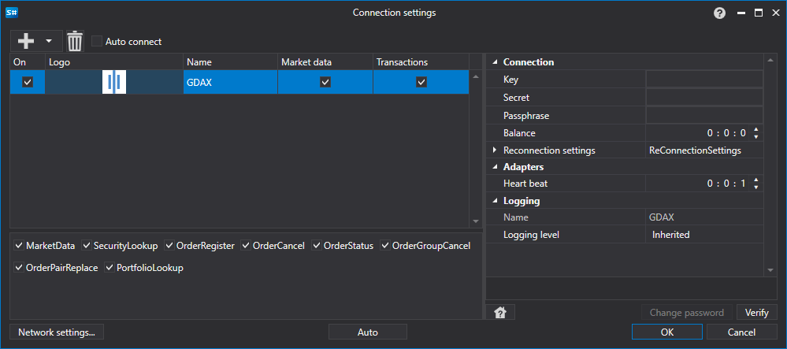

> [!CAUTION]
> **O serviço GDAX não está mais disponível. Seu sucessor, Coinbase Pro, também foi descontinuado; para a Coinbase, use o conector Coinbase atual. Este conector não funciona; a documentação é mantida apenas para referência.**

# Configuração gráfica GDAX

Para todos os produtos [S#](../../../../api.md), a configuração gráfica da ligação é realizada na [Janela de definições de ligação](../../../graphical_user_interface/connection_settings_window.md):

- **chave** - Key.
- **segredo** - segredo da API.
- **frase-passe** - Frase-passe.
- **Saldo** - Intervalo de verificação do saldo. Necessário em caso de ações de depósito e levantamento.
- **Intervalo de verificação da ligação** - Intervalo de verificação do servidor para acompanhar se a ligação está ativa. Por predefinição, é igual a 1 minuto.
- **Definições de religação** - Mecanismo para acompanhar ligações com as definições do sistema de negociação. ([Definições de religação](../../reconnection_settings.md))

## Conteúdo recomendado

[Conectores](../../../connectors.md)

[Configuração gráfica](../../graphical_configuration.md)

[Criar o próprio conector](../../creating_own_connector.md)

[Guardar e carregar definições](../../save_and_load_settings.md)

