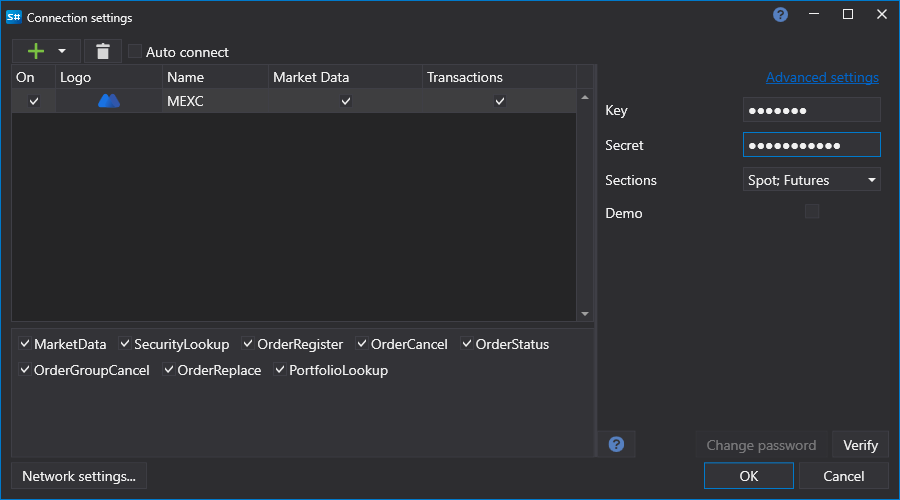

# Configuração gráfica do MEXC

Para todos os produtos [S#](../../../../api.md), a configuração gráfica da ligação é efetuada na [Janela de definições de ligação](../../../graphical_user_interface/connection_settings_window.md):

- **Key** - chave.
- **Secret** - segredo.
- **Demo** - modo de demonstração.
- **Reconnection settings** - parâmetros do mecanismo de reconexão com o sistema de negociação ([Definições de reconexão](../../reconnection_settings.md)).
