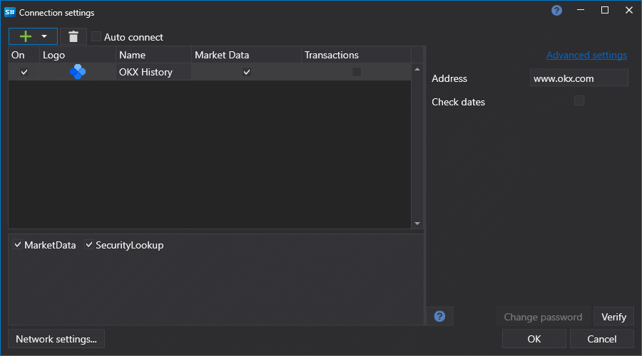

# Configuração gráfica OKEx History

Para todos os produtos [S#](../../../../api.md), a configuração gráfica da ligação é efetuada na [janela de definições de ligação](../../../graphical_user_interface/connection_settings_window.md):

- **Check dates** - validar as datas solicitadas antes de enviar pedidos de transferência.
