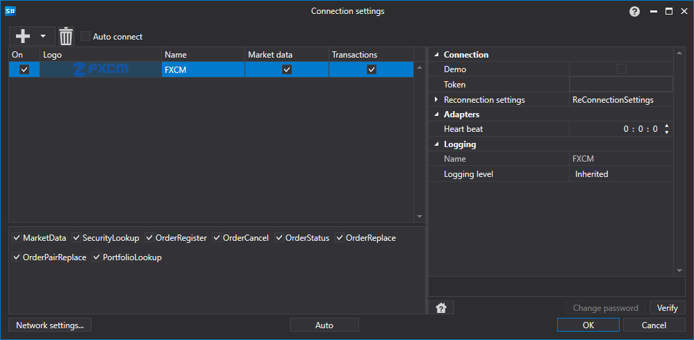

# Configuração gráfica FXCM

Para todos os produtos [S#](../../../../api.md), a configuração gráfica da ligação é realizada na [Janela de definições de ligação](../../../graphical_user_interface/connection_settings_window.md):

- **Token** - Token.
- **Demo** - Ligar à negociação demo em vez do servidor de negociação real.
- **Heartbeat** - Intervalo de verificação do servidor para acompanhar se a ligação está ativa. Por predefinição, é igual a 1 minuto.
- **Reconnection settings** - Mecanismo para acompanhar ligações com as definições do sistema de negociação. ([Definições de religação](../../reconnection_settings.md))

## Conteúdo recomendado

[Conectores](../../../connectors.md)

[Configuração gráfica](../../graphical_configuration.md)

[Criar o seu próprio conector](../../creating_own_connector.md)

[Guardar e carregar definições](../../save_and_load_settings.md)
