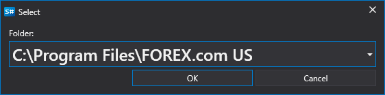
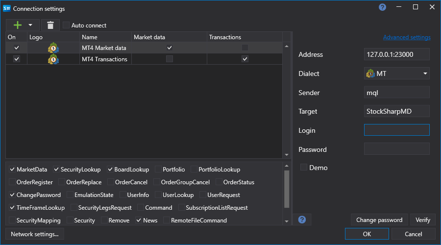
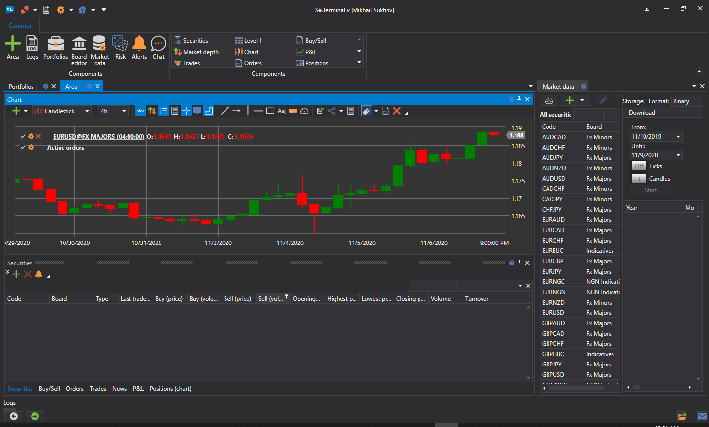

# MetaTrader

[StockSharp](../../../api.md) integra-se com os terminais MT4 e MT5 através de conectores especiais. Para instalar estes conectores, utilize o [Installer](../../../installer.md) (para mais detalhes, consulte [Instalar e remover programas](../../../installer/install_and_remove_apps.md)).

Ambos os conectores são utilizados da mesma forma, pelo que abaixo é descrito o processo de ligação ao MT5:

## Configurar o conector MT

> [!Video https://www.youtube.com/embed/qGnIa7YIS5Q]

1. Selecione o conector MT no [Installer](../../../installer.md) e inicie o processo de instalação.

   

2. O [Installer](../../../installer.md) perguntará em que pasta instalar o conector (deve ser instalado na pasta Experts).

   

3. Se estiverem instalados vários terminais, é necessário escolher aquele onde pretende instalar o conector.

   

4. Depois de selecionar o terminal pretendido, será apresentado o caminho para a pasta Experts.

   

   > [!TIP]
   > - Se o caminho não puder ser determinado automaticamente, é necessário selecioná-lo manualmente através da pesquisa de diretórios *C:\\Users\\%o_seu_nome_de_utilizador%\\AppData\\Roaming\\MetaQuotes\\Terminal\\%muitas_letras_e_numeros%\\MQL4\\Experts\\* (para MT5, o caminho incluirá MQL5).

5. Conclua a instalação e aguarde que termine. No fim da instalação, o [Installer](../../../installer.md) avisará que agora é necessário configurar o terminal. Para isso, inicie o terminal MT e ligue-se à negociação.
6. No menu Ferramentas -> Opções, selecione o separador **Consultores especializados** e certifique-se de que a permissão para negociação por DLL externa (**Permitir importações de DLL**) está ativada:
7. Se o terminal estava em execução durante a instalação do conector (passo 2), é necessário atualizar a lista de especialistas clicando com o botão direito em especialistas e selecionando **Atualizar** no menu:

   

8. Selecione o especialista S#, clique com o botão direito e escolha **Anexar a um gráfico** no menu:

   

9. Aparecerá uma janela de definições onde pode definir o nome de utilizador e a palavra-passe (a autorização anónima está ativada por predefinição), bem como o endereço de ligação (se se ligar a vários terminais ao mesmo tempo, os endereços devem conter portas únicas).
10. Deve aparecer um ícone sorridente no canto superior direito do gráfico (o primeiro encontrado):

    

    Além disso, na janela de registo do especialista deve aparecer informação sobre o arranque bem-sucedido do script e o número de instrumentos.
11. Se a licença MT4 ou MT5 não tiver sido obtida, aparecerá no registo uma linha semelhante à seguinte:

    

12. A ligação ao MT é feita através do protocolo FIX, utilizando o conector [Protocolo FIX](../common/fix_protocol.md). O programa [Terminal](../../../terminal.md) foi utilizado para demonstração. Abaixo encontram-se as definições para a ligação transacional e para a ligação de dados de mercado (para MT5, a porta predefinida é 23001 em vez de 23000):

    

    Definições semelhantes devem ser efetuadas no [Designer](../../../designer.md), no [Hydra](../../../hydra.md) ou em quaisquer programas de API.

    O login e a password são deixados vazios em caso de autorização anónima (item anterior). Se se ligar ao MT com vários robôs, deve ser indicado um login único para identificar as diferentes ligações.

    > [!TIP]
    > - O script deve ser iniciado antes de ligar o StockSharp ao MetaTrader e mantido em execução enquanto esta ligação for necessária.  
    > - Para ver velas históricos no StockSharp, estes têm de ser descarregados do servidor MetaTrader. Para saber como fazê-lo, leia a documentação do MetaTrader.

    Em caso de ligação bem-sucedida, o exemplo deverá mostrar uma lista de instrumentos e contas:

    

13. Em caso de erros, são mantidos registos do conector, disponíveis na pasta **Experts\\StockSharp\\Data\\Log**:

    
