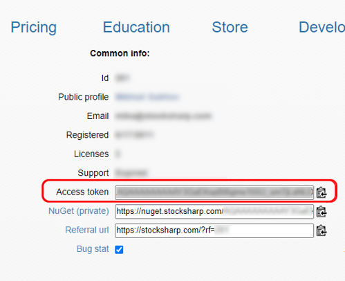

# Autorização OAuth

Para utilizar autorização OAuth em conectores no seu programa, é necessário registar vários serviços:

```csharp
// Ligar o armazenamento de palavras-passe para acesso ao StockSharp WebAPI.
ConfigManager.RegisterService<ICredentialsProvider>(new DefaultCredentialsProvider());
//ConfigManager.RegisterService<ICredentialsProvider>(new TokenCredentialsProvider("%token%"));

// Ligar o fornecedor de serviços para acesso ao StockSharp WebAPI
ConfigManager.RegisterService<IApiServiceProvider>(new ApiServiceProvider());
							
// Serviço de autorização OAuth que será usado pelos conectores
ConfigManager.RegisterService<IOAuthProvider>(new OAuthProvider());
//ConfigManager.RegisterService<IOAuthProvider>(new WebApiOAuthProvider());
```

- [DefaultCredentialsProvider](xref:StockSharp.Configuration.DefaultCredentialsProvider) e [TokenCredentialsProvider](xref:StockSharp.Configuration.TokenCredentialsProvider) implementam a interface [ICredentialsProvider](xref:StockSharp.Configuration.ICredentialsProvider).
- [ApiServiceProvider](xref:StockSharp.Web.Api.Client.ApiServiceProvider) implementa a interface [IApiServiceProvider](xref:StockSharp.Web.Api.Client.IApiServiceProvider).
- `OAuthProvider` implementa a interface [IOAuthProvider](xref:Ecng.Net.IOAuthProvider).

Existem duas opções de implementação para [ICredentialsProvider](xref:StockSharp.Configuration.ICredentialsProvider):

1. [DefaultCredentialsProvider](xref:StockSharp.Configuration.DefaultCredentialsProvider) - carrega os dados da conta StockSharp a partir de um ficheiro local. É necessária autorização prévia. Por exemplo, através do Installer.

2. [TokenCredentialsProvider](xref:StockSharp.Configuration.TokenCredentialsProvider) - passa o token diretamente a partir do código. Não é necessário nenhum ficheiro secreto na máquina. O token é obtido em [https://stocksharp.ru/profile/](https://stocksharp.ru/profile/):

   

Existem duas opções de implementação para [IOAuthProvider](xref:Ecng.Net.IOAuthProvider):

1. [WebApiOAuthProvider](xref:StockSharp.Studio.WebApi.WebApiOAuthProvider) - para aplicações de consola onde não é necessário apresentar uma janela de autorização.

2. [OAuthProvider](xref:StockSharp.Studio.Controls.OAuthProvider) - para aplicações WPF onde é necessário apresentar uma janela de autorização:

   
