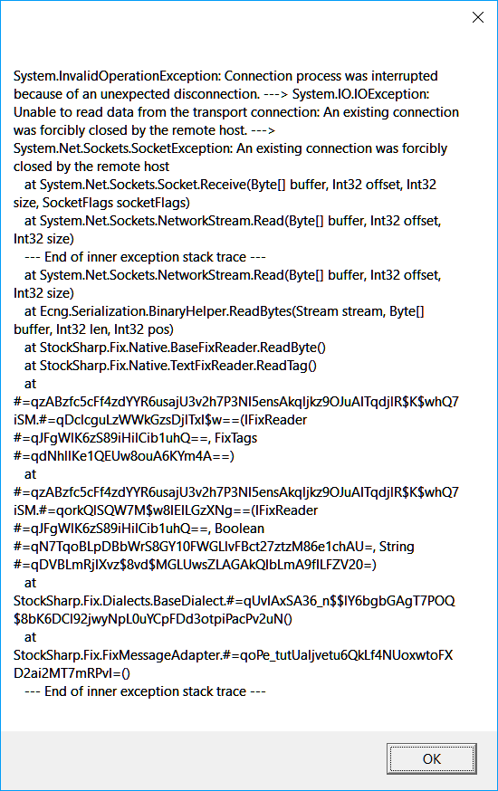

# Definições de religação

Todos os conectores disponibilizam a possibilidade de configurar a religação em caso de desconexão. No elemento gráfico [Janela de definições de ligação](../graphical_user_interface/connection_settings_window.md), tem o seguinte aspeto: 


**Propriedades de religação**

- **Interval** - O intervalo em que ocorrerão as tentativas de ligação. 
- **Initially** - O número de tentativas para estabelecer a ligação inicial caso esta não tenha sido estabelecida (timeout, falha de rede, etc.). 
- **Reconnection** - O número de tentativas para religar se a ligação tiver sido interrompida durante a operação. 
- **Timeout** - Timeout para uma ligação\/desligação bem-sucedida. 
- **Operating mode** - O modo de operação durante o qual as tentativas de ligação devem ser efetuadas.

## Definições de religação no código

O mecanismo de religação é configurado através da propriedade [ReConnectionSettings](xref:StockSharp.Messages.IMessageAdapter.ReConnectionSettings) e permite monitorizar os seguintes cenários de erro: 

- Não é possível estabelecer uma ligação (sem comunicação, nome de utilizador\/password incorretos, etc.). A propriedade [ReConnectionSettings.AttemptCount](xref:StockSharp.Messages.ReConnectionSettings.AttemptCount) define o número de tentativas para estabelecer uma ligação. Por predefinição, é 0, o que significa que o modo está desativado. -1 significa um número infinito de tentativas. 
- A ligação foi interrompida durante a operação. A propriedade [ReConnectionSettings.ReAttemptCount](xref:StockSharp.Messages.ReConnectionSettings.ReAttemptCount) define o número de tentativas para religar a ligação. Por predefinição, é 100. -1 significa um número infinito de tentativas. 0 - o modo está desativado. 
- Ao ligar ou desligar uma ligação, os eventos correspondentes [IConnector.Connected](xref:StockSharp.BusinessEntities.IConnector.Connected) ou [IConnector.Disconnected](xref:StockSharp.BusinessEntities.IConnector.Disconnected) podem não ser recebidos durante muito tempo. Para estas situações, pode utilizar a propriedade [ReConnectionSettings.TimeOutInterval](xref:StockSharp.Messages.ReConnectionSettings.TimeOutInterval) para definir o timeout máximo aceitável para um evento bem-sucedido. Se, após este tempo, o evento pretendido não ocorrer, o evento [IConnector.ConnectionError](xref:StockSharp.BusinessEntities.IConnector.ConnectionError) é gerado com um erro de timeout. 

1. Ao criar um gateway, é necessário inicializar as definições do mecanismo de religação através da propriedade [ReConnectionSettings](xref:StockSharp.Messages.IMessageAdapter.ReConnectionSettings): 

   ```cs
   // initialize the reconnection mechanism (it will automatically connect 
   // every 10 seconds if the gateway loses connection with the server)
   Connector.Adapter.ReConnectionSettings.Interval = TimeSpan.FromSeconds(10);
   // reconnection will work only during the selected board working hours
   // (to disable reconnection when there is no trading normally, for example, at night)
   Connector.Adapter.ReConnectionSettings.WorkingTime = ExchangeBoard.Nasdaq.WorkingTime;
   ```
2. Para verificar como funciona o mecanismo de controlo da ligação, pode desligar a ligação à Internet: 

   
3. Abaixo está o log do programa, que mostra que a aplicação está inicialmente num estado ligado e, depois de desligar a ligação à Internet, a aplicação tenta religar. Após restaurar a ligação à Internet, a ligação da aplicação é restaurada: 

   
4. Uma vez que várias ligações podem ser utilizadas no [Connector](xref:StockSharp.Algo.Connector), por predefinição os eventos relacionados com a religação, como [ConnectionRestored](xref:StockSharp.Algo.Connector.ConnectionRestored), não são acionados, e os adaptadores de ligação tentam religar por si próprios. Para que o evento comece a ser gerado, é necessário definir o valor da propriedade [BasketMessageAdapter.SuppressReconnectingErrors](xref:StockSharp.Algo.BasketMessageAdapter.SuppressReconnectingErrors) do adaptador como **false**. 

   ```cs
   Connector.Adapter.SuppressReconnectingErrors = false;
   Connector.ConnectionError += error => this.Sync(() => MessageBox.Show(this, "Connection lost"));
   Connector.ConnectionRestored += adapter => this.Sync(() => MessageBox.Show(this, "Connection restored"));
   ```

   
