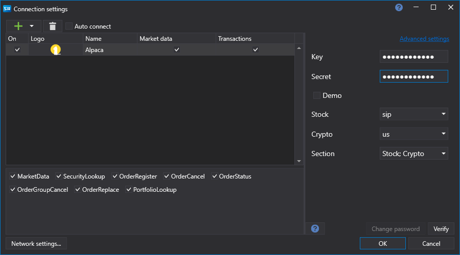

# Configuração gráfica Alpaca

Para todos os produtos [S#](../../../../api.md), a configuração gráfica da ligação é efetuada na [Janela de definições de ligação](../../../graphical_user_interface/connection_settings_window.md):

- **chave** - Chave.
- **segredo** - Secret.
- **Demo** - Modo sandbox.

## Ver também

[Conectores](../../../connectors.md)

[Configuração gráfica](../../graphical_configuration.md)

[Criar o próprio conector](../../creating_own_connector.md)

[Guardar e carregar definições](../../save_and_load_settings.md)
