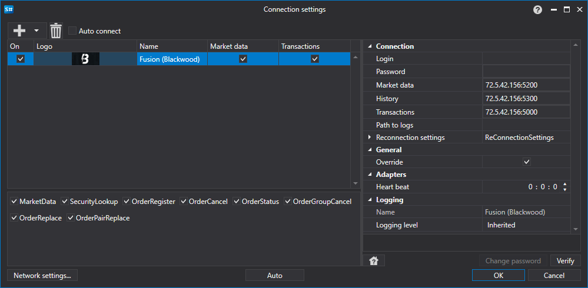

# Configuração gráfica Blackwood (Fusion)

Para todos os produtos [S#](../../../../api.md), a configuração gráfica da ligação é efetuada na [Janela de definições de ligação](../../../graphical_user_interface/connection_settings_window.md):

- **Login** - Login.
- **Password** - Password.
- **Market data** - Endereço do servidor de dados de mercado.
- **History** - Endereço do servidor de dados históricos.
- **Transactions** - Endereço do servidor de execução de transações.
- **Path to logs** - Caminho para o diretório onde será criado o ficheiro BWOrders.Log.
- **Override** - Substituir o ficheiro dll a partir dos recursos. Ativado por predefinição.
- **Heart beat** - Intervalo de verificação do servidor para monitorizar se a ligação está ativa. Por predefinição, é igual a 1 minuto.
- **Reconnection settings** - Mecanismo para monitorizar as ligações com as definições do sistema de negociação. ([Definições de religação](../../reconnection_settings.md))

## Ver também

[Conectores](../../../connectors.md)

[Configuração gráfica](../../graphical_configuration.md)

[Criar o próprio conector](../../creating_own_connector.md)

[Guardar e carregar definições](../../save_and_load_settings.md)
