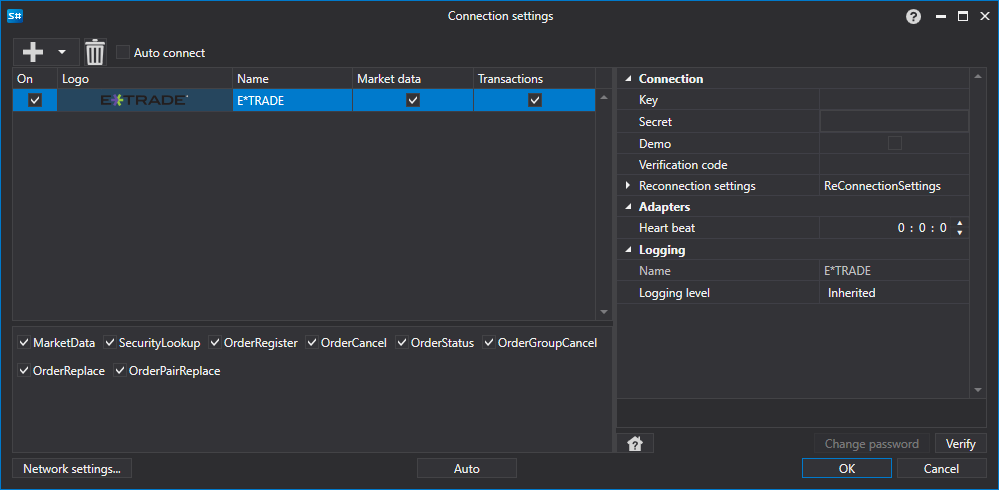

# Configuração gráfica E\*TRADE

Para todos os produtos [S#](../../../../api.md), a configuração gráfica da ligação é efetuada na [Janela de definições de ligação](../../../graphical_user_interface/connection_settings_window.md):

- **chave** - Chave.
- **segredo** - Segredo.
- **Demo** - Ligar à negociação demo em vez do servidor de negociação real.
- **Verification code** - Código de verificação recebido pelo utilizador no browser, depois de confirmar a permissão do programa para trabalhar.
- **Intervalo de verificação da ligação** - Intervalo de verificação do servidor para controlar se a ligação está ativa. Por predefinição, é igual a 1 minuto.
- **Definições de religação** - Mecanismo de controlo das ligações com as definições do sistema de negociação. ([Definições de religação](../../reconnection_settings.md))

## Conteúdo recomendado

[Conectores](../../../connectors.md)

[Configuração gráfica](../../graphical_configuration.md)

[Criar o próprio conector](../../creating_own_connector.md)

[Guardar e carregar definições](../../save_and_load_settings.md)
