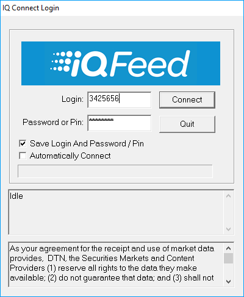

# IQFeed

**DTN IQFeed** - fornecedor de dados de mercado em tempo real para cotações de ações, Forex, notícias, contratos de futuros, etc..

Antes de começar a escrever robôs de negociação para esta plataforma de negociação, recomendamos ler as ligações na secção [Conectores](../../connectors.md).

## Configuração IQFeed

O mecanismo de interação é apresentado nesta figura:

Para trabalhar com o conector **IQFeed**, tem de instalar o router **IQ Feed Client** no computador, que pode ser instalado tanto no computador local como num computador remoto. A troca de dados entre a aplicação cliente e o **IQ Feed Client**, bem como entre o **IQ Feed Client** e os servidores, é efetuada através do protocolo TCP\/IP.

Para descarregar o **IQ Feed Client** a partir do site [IQFeed](https://www.iqfeed.net/stocksharp/), tem primeiro de efetuar a autorização com a password e o login recebidos da **iQFeed**.

Depois de instalar o **IQ Feed Client**, recomenda-se reiniciar o computador.

Depois de instalar o **IQ Feed Client, IQLink Launcher** tem de ser iniciado.

Na janela **IQLink Launcher** que se abre, clique em **Start IQLink**.

Na janela **IQ Connect Login** aberta, introduza o **nome de utilizador** e a **palavra-passe** (ou PIN) recebidos do serviço **iQFeed**. Estas credenciais não são as mesmas que o nome de utilizador e a palavra-passe do site **iQFeed**. Depois de introduzir as credenciais, clique em **Connect**.

Para receber dados, a aplicação cliente utiliza quatro ligações através de portas diferentes:

1. Level1 (porta 5009) é utilizado para obter dados em tempo real sobre instrumentos (ticks, preços de abertura e fecho, volatilidade, etc.) e notícias.
2. Level2 (porta 9200) é utilizado para obter cotações alargadas de instrumentos; para cada ECN é possível obter o melhor par de cotações.
3. Lookup (porta 9100) é utilizado para procurar instrumentos, obter dados históricos e obter informação avançada sobre notícias.
4. Admin (porta 9300) é utilizado para obter informação geral sobre a ligação e alterar definições.

Os números de porta utilizados por predefinição para ligação ao **IQ Feed Client** estão especificados entre parênteses. Para ligações de cliente, os números de porta podem ser alterados no registo, por exemplo, para Level1 no seguinte caminho: \[HKEY\_CURRENT\_USER\\SOFTWARE\\DTN\\IQFEED\\Startup\\Level1Port\]. Os números de porta para ligação aos servidores IQ não podem ser alterados.

> [!CAUTION]
> O conector suporta apenas o fluxo de dados de mercado; transações não são suportadas.

## Conteúdo recomendado

[Conectores](../../connectors.md)

[Configuração gráfica](../graphical_configuration.md)

[Guardar e carregar definições](../save_and_load_settings.md)

[Criar o próprio conector](../creating_own_connector.md)

[Gestão de Ordens](../../orders_management.md)

[Criar nova ordem](../../orders_management/create_new_order.md)

[Criar nova ordem stop](../../orders_management/create_new_stop_order.md)

[Ligação IQFeed](iqfeed/connection_iqfeed.md)

[Inicialização do adaptador IQFeed](iqfeed/adapter_initialization_iqfeed.md)
