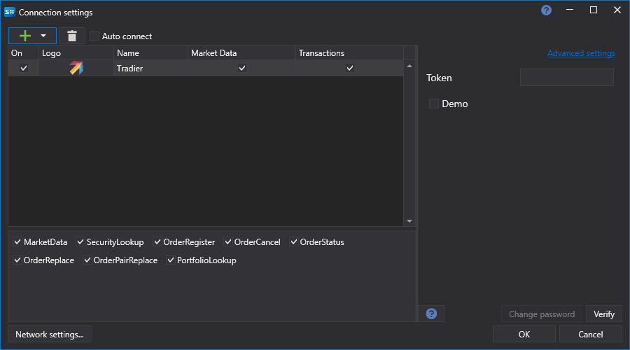

# Configuração gráfica do Tradier

Para todos os produtos StockSharp, a configuração gráfica da ligação é realizada no formulário de ecrã [Janela de definições de ligação](../../../graphical_user_interface/connection_settings_window.md):

- **Token** - Token de autorização.
- **Demonstração** - Modo de demonstração.

Autorização OAuth:

1. Pode inserir diretamente o token no campo "Token".
2. Se deixar o campo do token vazio e o modo "Demo" não estiver selecionado, será utilizada a autorização OAuth.

Processo de autorização OAuth:

1. Ao clicar no botão "Verificar", será aberta uma janela:

   

2. Depois de clicar em "Iniciar", o utilizador será redirecionado para o site da Tradier para iniciar sessão:

   

3. No site da Tradier, é necessário permitir o acesso da aplicação StockSharp às operações de negociação:

   

4. Depois disso, será redirecionado de volta para o site da StockSharp e o programa iniciará sessão automaticamente.

## Ver também

[Conectores](../../../connectors.md)

[OAuth](../../oauth.md)

[Configuração gráfica](../../graphical_configuration.md)

[Criar o próprio conector](../../creating_own_connector.md)

[Guardar e carregar definições](../../save_and_load_settings.md)
