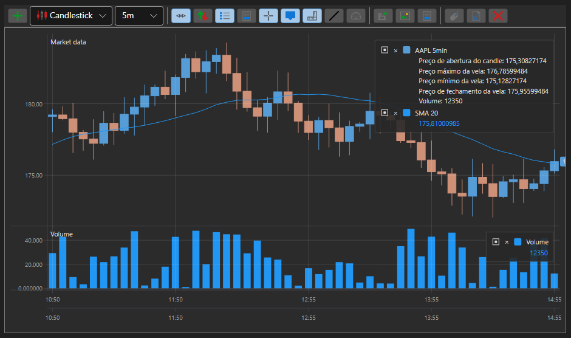

# Gráficos

[S#](../../api.md) fornece componentes convenientes para construir gráficos. Estes componentes estão reunidos no namespace [StockSharp.Xaml.Charting](xref:StockSharp.Xaml.Charting).

O conceito-chave na biblioteca gráfica é a noção de *gráfico*. Um *gráfico* é um contentor para outros elementos utilizados na construção de gráficos. Existem vários tipos de *gráficos* em [S#](../../api.md):

- [Chart](xref:StockSharp.Xaml.Charting.Chart) - Um componente gráfico para apresentar gráficos de bolsa.
- [ChartPanel](xref:StockSharp.Xaml.Charting.ChartPanel) - Um componente gráfico avançado para apresentar gráficos de bolsa.
- [EquityCurveChart](xref:StockSharp.Xaml.Charting.EquityCurveChart) - Um componente gráfico para apresentar curvas de capital.
- [BoxChart](charts/box_chart.md) - Um gráfico que representa volumes como uma grelha de números.
- [ClusterChart](charts/cluster_chart.md) - Um gráfico que apresenta volumes como clusters com histogramas.
- [OptionPositionChart](xref:StockSharp.Xaml.Charting.OptionPositionChart) - Um componente gráfico que mostra posições de opções e "Gregas" relativamente ao ativo subjacente. Ver [OptionPositionChart](options/position_chart.md).

Além disso, [S#](../../api.md) inclui dois tipos de gráficos para análise de volume: [BoxChart](charts/box_chart.md) e [ClusterChart](charts/cluster_chart.md).

A figura seguinte mostra os principais elementos do componente gráfico.

## Elementos do componente gráfico

## IChart

[IChart](xref:StockSharp.Charting.IChart) é a interface base para todos os tipos de gráficos. Inclui métodos para adicionar e remover elementos "filhos", propriedades para personalizar a aparência e os métodos de desenho do componente, bem como um método para desenhar os próprios gráficos. Um *gráfico* pode conter várias áreas ([IChartArea](xref:StockSharp.Charting.IChartArea)) para desenhar (ver figura). [Chart](xref:StockSharp.Xaml.Charting.Chart) também inclui uma área de pré-visualização *OverView* (ver figura). Nesta área, pode selecionar a zona de visualização do gráfico utilizando controlos deslizantes. Além disso, pode deslocar e ampliar/reduzir o gráfico arrastando o [IChartArea](xref:StockSharp.Charting.IChartArea), o eixo X e utilizando a roda do rato.

**Propriedades e métodos principais de [IChart](xref:StockSharp.Charting.IChart)**

- [IChart.Areas](xref:StockSharp.Charting.IChart.Areas) - Lista de áreas [IChartArea](xref:StockSharp.Charting.IChartArea).
- [IThemeableChart.ChartTheme](xref:StockSharp.Charting.IThemeableChart.ChartTheme) - Tema do componente.
- [IChart.IndicatorTypes](xref:StockSharp.Charting.IChart.IndicatorTypes) - Lista de indicadores que podem ser apresentados no gráfico.
- [IChart.CrossHair](xref:StockSharp.Charting.IChart.CrossHair) - Ativar/desativar a apresentação da cruz de mira.
- [IChart.CrossHairAxisLabels](xref:StockSharp.Charting.IChart.CrossHairAxisLabels) - Ativar/desativar a apresentação de etiquetas de eixo na cruz de mira.
- [IChart.IsAutoRange](xref:StockSharp.Charting.IChart.IsAutoRange) - Ativar/desativar o escalonamento automático do eixo X.
- [IChart.IsAutoScroll](xref:StockSharp.Charting.IChart.IsAutoScroll) - Ativar/desativar o deslocamento automático no eixo X.
- [IChart.ShowLegend](xref:StockSharp.Charting.IChart.ShowLegend) - Ativar/desativar a apresentação da legenda.
- [IChart.ShowOverview](xref:StockSharp.Charting.IChart.ShowOverview) - Ativar/desativar a apresentação da área de pré-visualização *OverView*.
- [IChart.AddArea](xref:StockSharp.Charting.IChart.AddArea(StockSharp.Charting.IChartArea)) - Adicionar um [IChartArea](xref:StockSharp.Charting.IChartArea).
- [IChart.AddElement](xref:StockSharp.Charting.IChart.AddElement(StockSharp.Charting.IChartArea, StockSharp.Charting.IChartElement)) - Adicionar um elemento de série de dados. Tem várias sobrecargas.
- [IChart.Reset](xref:StockSharp.Charting.IChart.Reset(System.Collections.Generic.IEnumerable{StockSharp.Charting.IChartElement})) - "Repor" valores desenhados anteriormente.
- [IChart.Draw](xref:StockSharp.Charting.IThemeableChart.Draw(StockSharp.Charting.IChartDrawData)) - Desenhar um valor no gráfico.
- [IChart.OrderCreationMode](xref:StockSharp.Charting.IChart.OrderCreationMode) - Modo de criação de ordens; quando definido, permite criar ordens a partir do gráfico. Por predefinição está desligado.

## IChartArea

[IChartArea](xref:StockSharp.Charting.IChartArea) - Uma área de desenho do gráfico, que atua como contentor para [IChartElement](xref:StockSharp.Charting.IChartElement) (indicadores, velas, etc.) renderizados no gráfico, e para os eixos do gráfico ([IChartAxis](xref:StockSharp.Charting.IChartAxis)).

**Propriedades principais de [IChartArea](xref:StockSharp.Charting.IChartArea)**

- [IChartArea.Elements](xref:StockSharp.Charting.IChartArea.Elements) - Lista de [IChartElement](xref:StockSharp.Charting.IChartElement).
- [IChartArea.XAxises](xref:StockSharp.Charting.IChartArea.XAxises) - Lista de eixos horizontais.
- [IChartArea.YAxises](xref:StockSharp.Charting.IChartArea.YAxises) - Lista de eixos verticais.

## IChartElement

Todos os elementos apresentados no gráfico devem implementar a interface [IChartElement](xref:StockSharp.Charting.IChartElement). Em [S#](../../api.md), as seguintes classes implementam esta interface:

- [ChartCandleElement](xref:StockSharp.Xaml.Charting.ChartCandleElement) - Um elemento para apresentar velas.
- [ChartIndicatorElement](xref:StockSharp.Xaml.Charting.ChartIndicatorElement) - Um elemento para apresentar indicadores.
- [ChartOrderElement](xref:StockSharp.Xaml.Charting.ChartOrderElement) - Um elemento para apresentar ordens.
- [ChartTradeElement](xref:StockSharp.Xaml.Charting.ChartTradeElement) - Um elemento para apresentar negócios.

As classes de elementos visuais têm várias propriedades para ajustar a aparência do gráfico. Pode ajustar cores, espessura de linha e estilo dos elementos. Por exemplo, utilizando a propriedade [IChartCandleElement.DrawStyle](xref:StockSharp.Charting.IChartCandleElement.DrawStyle), pode alterar a aparência da vela (vela ou barra). Utilizando a propriedade [ChartIndicatorElement.DrawStyle](xref:StockSharp.Xaml.Charting.ChartIndicatorElement.DrawStyle), pode definir o estilo da linha do indicador. Para apresentar o indicador como histograma, utilize o valor [DrawStyles.Histogram](xref:Ecng.Drawing.DrawStyles.Histogram). As propriedades [ChartCandleElement.ShowAxisMarker](xref:StockSharp.Xaml.Charting.ChartCandleElement.ShowAxisMarker) e [ChartIndicatorElement.ShowAxisMarker](xref:StockSharp.Xaml.Charting.ChartIndicatorElement.ShowAxisMarker) permitem ligar/desligar a apresentação de marcadores (ver figura) nos eixos do gráfico.

## Ver também

- [Gráficos JavaScript](../javascript_ui/charts.md)
- [Gráfico de velas](charts/candle_chart.md)
- [Painel de gráfico](charts/candle_chart_panel.md)
- [Gráfico de curva de capital](charts/equity_curve_chart.md)
- [Gráficos Box](charts/box_chart.md)
- [Clusters](charts/cluster_chart.md)
