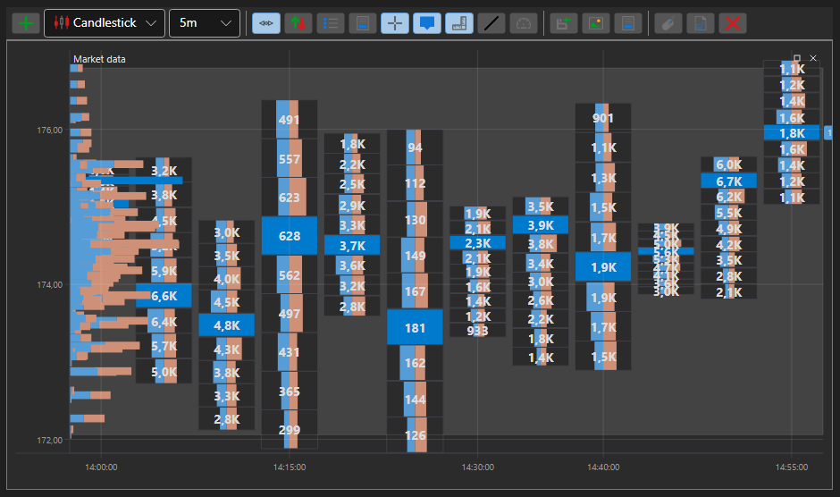

# Gráfico de caixas

BoxChart - é um tipo especial de gráfico para apresentar volumes na forma de uma grelha de números. Para utilizar este tipo de gráfico, é necessário definir o estilo especial [ChartCandleElement.DrawStyle](xref:StockSharp.Xaml.Charting.ChartCandleElement.DrawStyle) \= [ChartCandleDrawStyles.BoxVolume](xref:StockSharp.Charting.ChartCandleDrawStyles.BoxVolume). Este gráfico utiliza a informação da propriedade [PriceLevels](xref:StockSharp.Messages.CandleMessage.PriceLevels) como dados de origem.

**Propriedades principais**

- [ChartCandleElement.Timeframe2Multiplier](xref:StockSharp.Xaml.Charting.ChartCandleElement.Timeframe2Multiplier) - o fator multiplicador aplicado ao período principal especificado no construtor para obter um segundo período. As velas apresentadas são agrupadas em grupos de tamanho correspondente ao segundo período. Os grupos são desenhados no gráfico pela grelha e pela moldura das cores respetivas.
- [ChartCandleElement.Timeframe3Multiplier](xref:StockSharp.Xaml.Charting.ChartCandleElement.Timeframe3Multiplier) - semelhante a [ChartCandleElement.Timeframe2Multiplier](xref:StockSharp.Xaml.Charting.ChartCandleElement.Timeframe2Multiplier), mas para o terceiro período. O 3.º período é desenhado no gráfico utilizando a grelha da cor correspondente.
- [ChartCandleElement.FontColor](xref:StockSharp.Xaml.Charting.ChartCandleElement.FontColor) - a cor dos valores de volume no gráfico.
- [ChartCandleElement.MaxVolumeColor](xref:StockSharp.Xaml.Charting.ChartCandleElement.MaxVolumeColor) - a cor dos valores de volume no gráfico para o volume máximo na vela especificada.
- [ChartCandleElement.Timeframe2Color](xref:StockSharp.Xaml.Charting.ChartCandleElement.Timeframe2Color) - a cor da grelha do 2.º período.
- [ChartCandleElement.Timeframe2FrameColor](xref:StockSharp.Xaml.Charting.ChartCandleElement.Timeframe2FrameColor) - a cor da moldura do 2.º período.
- [ChartCandleElement.Timeframe3Color](xref:StockSharp.Xaml.Charting.ChartCandleElement.Timeframe3Color) - a cor da grelha do 3.º período.

Um exemplo de utilização deste tipo de gráfico está em *Samples\/Common\/SampleChart*.

> [!TIP]
> Para alternar entre os tipos de gráfico, utilize o botão de definições (engrenagem), localizado no canto superior esquerdo do gráfico.
