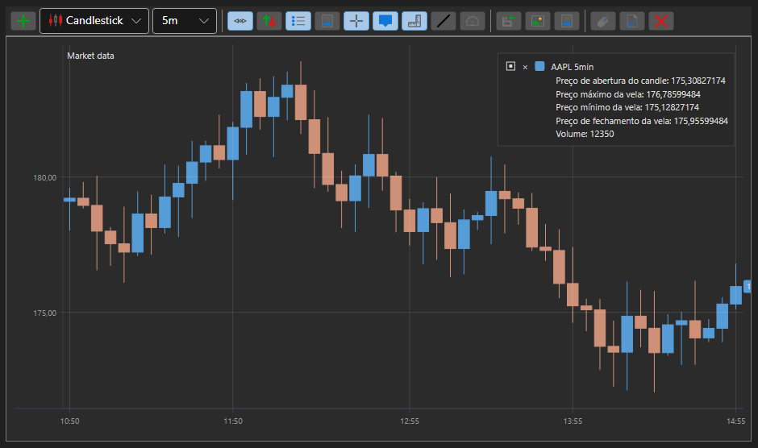

# Gráfico de velas

[Chart](xref:StockSharp.Xaml.Charting.Chart) é um componente gráfico que permite construir gráficos de bolsa: velas, indicadores e apresentar marcadores de ordens e negócios nos gráficos.

Abaixo está um exemplo de construção de um gráfico utilizando o componente [Chart](xref:StockSharp.Xaml.Charting.Chart). O exemplo baseia-se em Samples\/02\_Candles\/01\_Realtime, com algumas modificações.



## Exemplo de construção de um gráfico utilizando Chart

1. Em XAML, criamos uma janela e adicionamos-lhe o componente gráfico [Chart](xref:StockSharp.Xaml.Charting.Chart). Atribuímos o nome **Chart** ao componente. Note que, ao criar a janela, é necessário adicionar o namespace *http:\/\/schemas.stocksharp.com\/xaml*.

   ```xaml
   <Window x:Class="SampleCandles.ChartWindow"
           xmlns="http://schemas.microsoft.com/winfx/2006/xaml/presentation"
           xmlns:x="http://schemas.microsoft.com/winfx/2006/xaml"
           xmlns:charting="http://schemas.stocksharp.com/xaml"
           Title="ChartWindow" Height="300" Width="300">
      <charting:Chart x:Name="Chart" x:FieldModifier="public" />
   </Window>
   ```

2. No código da janela principal, declaramos variáveis para áreas do gráfico, elementos do gráfico, indicadores e subscrições.

   ```cs
   private readonly Dictionary<Subscription, ChartWindow> _chartWindows = new Dictionary<Subscription, ChartWindow>();
   private readonly Connector _connector = new Connector();
   private readonly LogManager _logManager;
   private ChartArea _candlesArea;
   private ChartArea _indicatorsArea;
   private ChartIndicatorElement _smaChartElement;
   private ChartIndicatorElement _macdChartElement;
   private ChartCandleElement _candlesElem;
   private SimpleMovingAverage _sma;
   private MovingAverageConvergenceDivergence _macd;
   ```

3. No manipulador do evento **Click** do botão **Connect**, juntamente com a subscrição dos eventos do conector e a chamada ao método [IConnector.Connect](xref:StockSharp.BusinessEntities.IConnector.Connect), subscrevemos o evento [Connector.CandleReceived](xref:StockSharp.Algo.Connector.CandleReceived). Neste manipulador de evento, o gráfico será desenhado quando uma nova vela for recebida.

   ```cs
   private void ConnectClick(object sender, RoutedEventArgs e)
   {
       _connector.CandleReceived += OnCandleReceived;
       
       // Subscrever outros eventos necessários
       _connector.Connected += () => this.GuiAsync(() => { /* Processar conexão */ });
       _connector.Disconnected += () => this.GuiAsync(() => { /* Processar desconexão */ });
       
       // Ligar ao sistema de negociação
       _connector.Connect();
   }
   ```

4. No manipulador do botão **ShowChart**, criamos objetos de indicadores, áreas e elementos do gráfico. Adicionamos elementos às áreas e áreas ao gráfico. Abrimos a janela do gráfico e iniciamos uma subscrição de velas.

   ```cs
   private void ShowChartClick(object sender, RoutedEventArgs e)
   {
       var security = SelectedSecurity;
       
       // Criar uma subscrição de velas
       var subscription = new Subscription(
           DataType.TimeFrame(TimeSpan.FromMinutes(5)),
           security)
       {
           MarketData = 
           {
               // Pedir dados históricos de 30 dias
               From = DateTime.Today.Subtract(TimeSpan.FromDays(30)),
               To = DateTime.Now,
               // Obter apenas velas concluídas
               IsFinishedOnly = true
           }
       };
       
       // Criar uma janela de gráfico
       _chartWindows.SafeAdd(subscription, key =>
       {
           var wnd = new ChartWindow
           {
               Title = $"{security.Code} {TimeSpan.FromMinutes(5)}"
           };
           wnd.MakeHideable();
           
           // Inicializar indicadores
           _sma = new SimpleMovingAverage() { Length = 11 };
           _macd = new MovingAverageConvergenceDivergence();
           
           // Inicializar elementos do gráfico
           _smaChartElement = new ChartIndicatorElement();
           _macdChartElement = new ChartIndicatorElement();
           _candlesElem = new ChartCandleElement();
           
           // Definir o estilo de apresentação MACD como histograma
           _macdChartElement.DrawStyle = DrawStyles.Histogram;
           
           // Inicializar áreas do gráfico
           _candlesArea = new ChartArea();
           _indicatorsArea = new ChartArea();
           
           // Adicionar áreas ao gráfico
           wnd.Chart.Areas.Add(_candlesArea);
           wnd.Chart.Areas.Add(_indicatorsArea);
           
           // Adicionar elementos às áreas
           _candlesArea.Elements.Add(_candlesElem);
           _candlesArea.Elements.Add(_smaChartElement);
           _indicatorsArea.Elements.Add(_macdChartElement);
           
           // Associar elementos do gráfico à subscrição para desenho automático
           wnd.Chart.AddElement(_candlesArea, _candlesElem, subscription);
           wnd.Chart.AddElement(_candlesArea, _smaChartElement, subscription);
           wnd.Chart.AddElement(_indicatorsArea, _macdChartElement, subscription);
           
           return wnd;
       }).Show();
       
       // Iniciar subscrição de velas
       _connector.Subscribe(subscription);
   }
   ```

5. No manipulador do evento [Connector.CandleReceived](xref:StockSharp.Algo.Connector.CandleReceived), desenhamos a vela e os valores dos indicadores para cada vela concluída.

   ```cs
   private void OnCandleReceived(Subscription subscription, ICandleMessage candle)
   {
       var wnd = _chartWindows.TryGetValue(subscription);
       if (wnd == null)
           return;
       
       // Processar apenas velas concluídas
       if (candle.State != CandleStates.Finished)
           return;
       
       // Calcular valores dos indicadores
       var smaValue = _sma.Process(candle);
       var macdValue = _macd.Process(candle);
       
       // Criar dados para desenho
       var data = new ChartDrawData();
       data
           .Group(candle.OpenTime)
               .Add(_candlesElem, candle)
               .Add(_smaChartElement, smaValue)
               .Add(_macdChartElement, macdValue);
       
       // Desenhar dados no gráfico na thread da interface de utilizador
       this.GuiAsync(() => wnd.Chart.Draw(data));
   }
   ```

## Exemplo com desenho automático do gráfico

A partir das versões mais recentes do StockSharp, é possível configurar o desenho automático do gráfico sem a necessidade de chamar explicitamente o método Draw. Para isso, ao configurar Chart, é utilizado o método AddElement, que liga o elemento do gráfico a uma subscrição:

```cs
private void SetupAutoDrawingChart()
{
	var security = SelectedSecurity;
	
	// Criar elementos do gráfico
	var candleElement = new ChartCandleElement();
	var smaElement = new ChartIndicatorElement { Title = "SMA" };
	
	// Criar áreas do gráfico
	var area = new ChartArea();
	
	// Adicionar área ao gráfico
	Chart.Areas.Add(area);
	
	// Criar uma subscrição de velas
	var subscription = new Subscription(
		DataType.TimeFrame(TimeSpan.FromMinutes(5)),
		security)
	{
		MarketData = 
		{
			From = DateTime.Today.Subtract(TimeSpan.FromDays(30)),
			To = DateTime.Now
		}
	};
	
	// Associar elementos à área do gráfico e à subscrição
	Chart.AddElement(area, candleElement, subscription);
	Chart.AddElement(area, smaElement, subscription);
	
	// Criar um indicador
	var sma = new SimpleMovingAverage { Length = 14 };
	
	// Subscrever o evento de receção de velas para processamento do indicador
	_connector.CandleReceived += (sub, candle) => 
	{
		if (sub == subscription && candle.State == CandleStates.Finished)
		{
			// Processar a vela com o indicador e obter o valor
			var smaValue = sma.Process(candle);
			
			// Desenhar o valor do indicador
			var data = new ChartDrawData();
			data
				.Group(candle.OpenTime)
					.Add(smaElement, smaValue);
			
			this.GuiAsync(() => Chart.Draw(data));
		}
	};
	
	// Iniciar subscrição
	_connector.Subscribe(subscription);
}
```

## Apresentação de ordens e negócios no gráfico

Pode apresentar marcadores de ordens e negócios diretamente no gráfico:

```cs
// Criar elementos para apresentar ordens e negócios
var orderElement = new ChartOrderElement();
var tradeElement = new ChartTradeElement();

// Adicionar elementos à área do gráfico
_candlesArea.Elements.Add(orderElement);
_candlesArea.Elements.Add(tradeElement);

// Subscrever eventos de receção de ordens e negócios
_connector.OrderReceived += (sub, order) => 
{
	if (order.Security != _security)
		return;
	
	// Desenhar a ordem no gráfico
	var data = new ChartDrawData();
	data.Group(order.Time).Add(orderElement, order);
	
	this.GuiAsync(() => Chart.Draw(data));
};

_connector.OwnTradeReceived += (sub, trade) => 
{
	if (trade.Order.Security != _security)
		return;
	
	// Desenhar o negócio no gráfico
	var data = new ChartDrawData();
	data.Group(trade.Time).Add(tradeElement, trade);
	
	this.GuiAsync(() => Chart.Draw(data));
};
```

## Limpar o gráfico

Para limpar o gráfico, pode utilizar o método Reset:

```cs
// Limpar todo o gráfico
Chart.Reset();

// Limpar uma área específica
_candlesArea.Reset();

// Limpar um elemento específico
_candlesElem.Reset();
```
